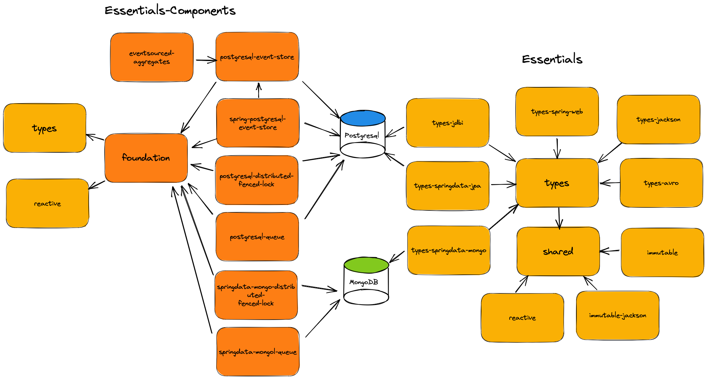
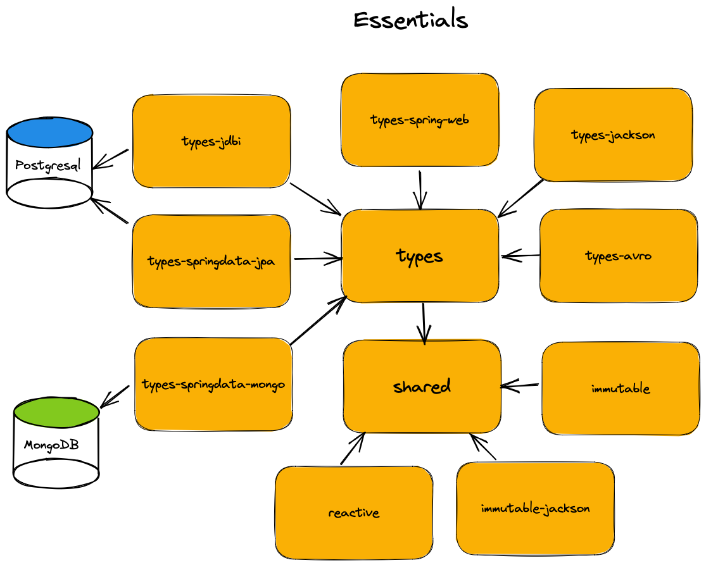

# Essentials Java building blocks

Essentials is a set of Java version 11 (and later) building blocks built from the ground up to have no dependencies
on other libraries, unless explicitly mentioned.

The Essentials philosophy is to provide high level building blocks and coding constructs that allows for concise and
strongly typed code, which doesn't depend on other libraries or frameworks, but instead allows easy integrations with
many of the most popular libraries and frameworks such as Jackson, Spring Boot, Spring Data, JPA, etc.

All essentials modules that depend on third party dependencies, such as Spring, JDBI, etc. are using the Maven `provided` scope for these dependencies.
Dependencies with `provided` scope are only available at compile time and in the test classpath of the Essentials project. 
This means that any dependencies with `provided` scope are not transitive (i.e. not available for projects that depend on Essentials), which also means that the user of Essentials
need to add these third party dependencies (such as Spring, JDBI, Postgresql JDBC driver, etc.) to their project themselves.  

Each module's README.md will provide information about which third party dependencies that are typically for the Essentials module to be functional.

## Essentials modules


## Advanced Components
See: [Essentials Components](components/README.md) for information about **components** such as `EventStore`, `EventSourced Aggregates`, `FencedLocks`, `DurableQueues`, `DurableLocalCommandbus`, `Inbox` and `Outbox` 
Also includes Spring Boot auto-configuration modules for Postgresql and MongoDB:
- See [spring-boot-starter-postgresql](components/spring-boot-starter-postgresql/README.md)
- See [spring-boot-starter-mongodb](components/spring-boot-starter-mongodb/README.md)


**NOTE:**
**The libraries are WORK-IN-PROGRESS**

## Shared

This library contains the smallest set of supporting building blocks needed for other Essentials libraries, such as:

- **Tuples**
    - E.g. `Triple<String, Long, BigDecimal> tuple = Tuple.of("Hello", 100L, new BigDecimal("125.95"));`
- **Collections**
    - E.g. `Stream<Pair<Integer, String>> indexedStream = Lists.toIndexedStream(List.of("A", "B", "C"));`
- **Functional Interfaces**
    - E.g. `Tuple.of("Hello", 100L, new BigDecimal("125.95")).map((_1, _2, _3) -> Tuple.of(_1.toString(), _2.toString(), _3.toString))`
    - Checked variant of the classic Functional-Interfaces (`Runnable`, `Consumer`, `Supplier`, `Function`, `BiFunction` and `TripleFunction`)
      that behaves like the normal Functional-Interface, but which allows checked `Exception`'s to be thrown from their method:
      - `CheckedRunnable`
      - `CheckedConsumer`
      - `CheckedSupplier`
      - `CheckedFunction`
      - `CheckedBiFunction`
      - `CheckedTripleFunction`
- `FailFast` argument validation (Objects.requireNonNull replacement)
    - E.g. `FailFast.requireNonBlank(fieldName, "You must supply a fieldName");`
- **`If` expression** that supports both simple boolean predicate/condition and fixed value return values as well as lambda predicates and return value suppliers:
  - ```
    String description = If(value < 0, () -> "Negative number").
                         ElseIf(() -> value == 0, "Zero").
                         Else("Positive number");
    ```
- `GenericType`
    - With `GenericType` you can specify and capture parameterized type information: `var genericType = new GenericType<List<Money>>(){};`
- `StopWatch` for timing different methods/operations
- `Exceptions` that allow `sneakyThrow` and getting a stacktrace as a String
- SLF4J compatible **Message formatter**
  - E.g. `msg("Failed to find static method '{}' on type '{}' taking arguments of {}", methodName, type.getName(), Arrays.toString(argumentTypes))`
- High level **Reflection** API
    - E.g. `Reflector.reflectOn(someType).invokeStatic("of");`
- `PatternMatchingMethodInvoker` which supports creating your own reflective pattern matching method invokers.



To use `Shared` just add the following Maven dependency:
```
<dependency>
    <groupId>dk.cloudcreate.essentials</groupId>
    <artifactId>shared</artifactId>
    <version>0.8.7</version>
</dependency>
```

See [shared](shared/README.md) for more information

## Types

This library focuses purely on providing base semantic types and utility types that can be used to better documented and more
strongly typed code.  
With this libraries `SingleValueType` concept you can create your High Level semantic types that works well using e.g. Jackson,
Spring Data Mongo, etc:

```
public class CreateOrder {
    public final OrderId                  id;
    public final Amount                   totalAmountWithoutSalesTax;
    public final Currency                 currency;
    public final Percentage               salesTax;
    public final Map<ProductId, Quantity> orderLines;

    ...
}
```

where a minimal custom identifier looks like this:

```
public class OrderId extends CharSequenceType<OrderId> implements Identifier {
    public OrderId(CharSequence value) {
        super(value);
    }
}
```

To use `Types` just add the following Maven dependency:
```
<dependency>
    <groupId>dk.cloudcreate.essentials</groupId>
    <artifactId>types</artifactId>
    <version>0.8.7</version>
</dependency>
```

See [types](types/README.md) for more information

## Reactive

This library contains the smallest set of supporting reactive building blocks needed for other Essentials libraries

To use `Reactive` just add the following Maven dependency:
```
<dependency>
    <groupId>dk.cloudcreate.essentials</groupId>
    <artifactId>reactive</artifactId>
    <version>0.8.7</version>
</dependency>
```

See [reactive](reactive/README.md) for more information

### LocalEventBus
Simple event bus that supports both synchronous and asynchronous subscribers that are registered and listening for events published within the local the JVM  
You can have multiple instances of the LocalEventBus deployed with the local JVM, but usually one event bus is sufficient.

```
LocalEventBus localEventBus    = new LocalEventBus("TestBus", 3, (failingSubscriber, event, exception) -> log.error("...."));
                  
localEventBus.addAsyncSubscriber(orderEvent -> {
           ...
       });

localEventBus.addSyncSubscriber(orderEvent -> {
             ...
       });
                  
localEventBus.publish(new OrderCreatedEvent());
 ```

### LocalCommandBus
The `LocalCommandBus` provides an indirection between a command and the `CommandHandler` that's capable of handling the command.
Commands can be sent synchronously using `#send(Object)` or asynchronously using `#sendAsync(Object)` that returns a `Mono`.
The handling of a command usually doesn't return any value (according to the principles of CQRS), however the `LocalCommandBus` API allows
a `CommandHandler` to return a value if needed (e.g. such as a server generated id)

```
var commandBus = new LocalCommandBus();
commandBus.addCommandHandler(new CreateOrderCommandHandler(...));
commandBus.addCommandHandler(new ImburseOrderCommandHandler(...));
 
var optionalResult = commandBus.send(new CreateOrder(...));
// or
var monoWithOptionalResult = commandBus.sendAsync(new ImbuseOrder(...))
                                       .block(Duration.ofMillis(1000));
```

## Immutable

This library focuses purely on providing utility classes that make it easier to create **simple** immutable types/classes, that
doesn't rely on code generators.

The base type `ImmutableValueObject` supports creating immutable (i.e. an object where its values cannot change after object instantiation/creation) **Value Object**  
The core feature set of `ImmutableValueObject` is that it provides default implementations for `toString`, `equals` and `hashCode`, but you're always free to override this and provide your own
implementation.

Example:
```
public class ImmutableOrder extends ImmutableValueObject {
    public final OrderId                  orderId;
    public final CustomerId               customerId;
    @Exclude.EqualsAndHashCode
    public final Percentage               percentage;
    @Exclude.ToString
    public final Money                    totalPrice;

    public ImmutableOrder(OrderId orderId,
                          CustomerId customerId,
                          Percentage percentage,
                          EmailAddress email,
                          Money totalPrice) {
        this.orderId = orderId;
        this.customerId = customerId;
        this.percentage = percentage;
        this.totalPrice = totalPrice;
    }
}
```

To use `Immutable` just add the following Maven dependency:
```
<dependency>
    <groupId>dk.cloudcreate.essentials</groupId>
    <artifactId>immutable</artifactId>
    <version>0.8.7</version>
</dependency>
```

See [immutable](immutable/README.md) for more information

## Immutable Jackson
This library focuses purely on providing [Jackson (FasterXML)](https://github.com/FasterXML/jackson) deserialization support for immutable classes or other classes that don't have a suitable creator
(constructor, or no-arg static factory method, etc.).  
This is very useful for when you're using `Record`'s (in Java 14+) or other types supporting immutable objects, as it allows Jackson to create an object instance without requiring
a matching constructing.

Using this module means that you can deserialize an immutable class such as this one that only consists of `public final` fields and a single constructor that doesn't allow initialization of
all fields values during deserialization.
``` 
public final class ImmutableOrder {
    public final OrderId       orderId;
    public final CustomerId    customerId;
    public final Money         totalPrice;
    public final LocalDateTime orderedTimestamp;

    public ImmutableOrder(OrderId orderId,
                          CustomerId customerId,
                          Money totalPrice) {
        this.orderId = orderId;
        this.customerId = customerId;
        this.totalPrice = totalPrice;
        this.orderedTimestamp = LocalDateTime.now();
    }
}
```

### Configuration

All you need to do is to add the `dk.cloudcreate.essentials.jackson.immutable.EssentialsImmutableJacksonModule` to your `ObjectMapper`
configuration.

Example:

```
objectMapper.registerModule(new EssentialsImmutableJacksonModule());
```

To use `Immutable-Jackson` just add the following Maven dependency:
```
<dependency>
    <groupId>dk.cloudcreate.essentials</groupId>
    <artifactId>immutable-jackson</artifactId>
    <version>0.8.7</version>
</dependency>
```

See [immutable-jackson](immutable-jackson/README.md) for more information

## Types Jackson

This library focuses purely on providing [Jackson (FasterXML)](https://github.com/FasterXML/jackson) serialization and deserialization support
for the **types** defined in the Essentials `types` library.

All you need to do is to add the `dk.cloudcreate.essentials.types.EssentialTypesJacksonModule` to your `ObjectMapper` configuration:

```
objectMapper.registerModule(new EssentialTypesJacksonModule());
```

To use `Types-Jackson` just add the following Maven dependency:
```
<dependency>
    <groupId>dk.cloudcreate.essentials</groupId>
    <artifactId>types-jackson</artifactId>
    <version>0.8.7</version>
</dependency>
```

See [types-jackson](types-jackson/README.md) for more information

## Types Spring Data Mongo

This library focuses purely on providing [Spring Data MongoDB](https://spring.io/projects/spring-data-mongodb) persistence support for the **types** defined in the
Essentials `types` library.

All you need to do is to register the following Spring Beans to your Spring configuration:

```
@Bean
public SingleValueTypeRandomIdGenerator registerIdGenerator() {
    return new SingleValueTypeRandomIdGenerator();
}

@Bean
public MongoCustomConversions mongoCustomConversions() {
    return new MongoCustomConversions(List.of(new SingleValueTypeConverter()));
}
```

to support this Entity (including automatic Id generation):

```
@Document
public class Order {
    @Id
    public OrderId id;
    public CustomerId customerId;
    public AccountId accountId;
    public Map<ProductId, Quantity> orderLines;
    
    ...
}    
```

To use `Types-SpringData-Mongo` just add the following Maven dependency:
```
<dependency>
    <groupId>dk.cloudcreate.essentials</groupId>
    <artifactId>types-springdata-mongo</artifactId>
    <version>0.8.7</version>
</dependency>
```

See [types-springdata-mongo](types-springdata-mongo/README.md) for more information

## Types Spring Data JPA

This library focuses purely on providing [Spring Data JPA](https://spring.io/projects/spring-data-jpa) persistence support for the **types** defined in the
Essentials `types` library. Example:

```
@Entity
@Table(name = "orders")
public class Order {
    @Id
    public OrderId                  id;
    public CustomerId               customerId;
    public AccountId                accountId;
    @ElementCollection
    public Map<ProductId, Quantity> orderLines;
    
    ...
}
```

will work out of the box without the need for any custom `AttributeConverter`'s. BUT we currently don't support
automatic Id generation.

To use `Types-SpringData-JPA` just add the following Maven dependency:
```
<dependency>
    <groupId>dk.cloudcreate.essentials</groupId>
    <artifactId>types-springdata-jpa</artifactId>
    <version>0.8.7</version>
</dependency>
```

See [types-springdata-jpa](types-springdata-jpa/README.md) for more information

## Types Spring Web

This library focuses purely on providing [Spring](https://spring.io/projects/spring-framework) [WebMvc/MVC](https://docs.spring.io/spring-framework/docs/current/reference/html/web.html#spring-web) 
and [WebFlux](https://docs.spring.io/spring-framework/docs/current/reference/html/web-reactive.html#spring-webflux) `Converter` support for the **types** defined in the
Essentials `types` library.

To use `Types-Spring-Web` just add the following Maven dependency:
```
<dependency>
    <groupId>dk.cloudcreate.essentials</groupId>
    <artifactId>types-spring-web</artifactId>
    <version>0.8.7</version>
</dependency>
```

Using this library will allow you to deserialize `@PathVariable` `@RequestParam` method parameters of type `SingleValueType` for **WebMvc**
```
@PostMapping("/order/for-customer/{customerId}/update/total-price")
public ResponseEntity<Order> updatePrice(@PathVariable CustomerId customerId,
                                         @RequestParam("price") Amount price) {
    ...
}
```
and for **WebFlux**
```
@PostMapping("/reactive-order/for-customer/{customerId}/update/total-price")
public Mono<Order> updatePrice(@PathVariable CustomerId customerId,
                               @RequestParam("price") Amount price) {
    ...
}
```

See [types-spring-web](types-spring-web/README.md) for more information

## Types JDBI (v3)

This library focuses purely on providing [JDBI v3](https://jdbi.org) **argument** support for the **types** defined in the Essentials `types`
library.

You need to register your own `ArgumentFactory` with the `Jdbi` or `Handle` instance:

```
Jdbi jdbi = Jdbi.create("jdbc:h2:mem:test");
jdbi.registerArgument(new OrderIdArgumentFactory());
jdbi.registerArgument(new CustomerIdArgumentFactory());
jdbi.registerArgument(new ProductIdArgumentFactory());
jdbi.registerArgument(new AccountIdArgumentFactory());
    
var orderId    = OrderId.random();
var customerId = CustomerId.random();
var productId  = ProductId.random();
var accountId  = AccountId.random();

handle.useHandle(handle -> handle.createUpdate("INSERT INTO orders(id, customer_id, product_id, account_id) VALUES (:id, :customerId, :productId, :accountId)")
                                  .bind("id", orderId)
                                  .bind("customerId", customerId)
                                  .bind("productId", productId)
                                  .bind("accountId", accountId)
                                  .execute());
```

where `CustomerId` is defined as:

```
public class CustomerId extends CharSequenceType<CustomerId> implements Identifier {
    public CustomerId(CharSequence value) {
        super(value);
    }
}
```

And the `CustomerIdArgumentFactory` of type `CharSequenceType` must extend `CharSequenceTypeArgumentFactory`:

```
public class CustomerIdArgumentFactory extends CharSequenceTypeArgumentFactory<CustomerId> {
}
```

To use `Types-JDBI` just add the following Maven dependency:
```
<dependency>
    <groupId>dk.cloudcreate.essentials</groupId>
    <artifactId>types-jdbi</artifactId>
    <version>0.8.7</version>
</dependency>
```

See [types-jdbi](types-jdbi/README.md) for more information

## Types Avro
This library focuses purely on providing [AVRO](https://avro.apache.org) serialization and deserialization support for the **types** defined in the Essentials `types` library.

To use `Types-Avro` just add the following Maven dependency:
```
<dependency>
    <groupId>dk.cloudcreate.essentials</groupId>
    <artifactId>types-avro</artifactId>
    <version>0.8.7</version>
</dependency>
```

See [types-avro](types-avro/README.md) for more information

Some concrete `Types` such as `Amount`, `Percentage` and `CurrencyCode` come with supported our of the box.  
This allows you to define Avro schema/IDL protocol and directly refer these logical-types in your Avro Schema/IDL protocol. 

Example `order.avdl`:

```
@namespace("dk.cloudcreate.essentials.types.avro.test")
protocol Test {
  record Order {
      string           id;
      @logicalType("Amount")
      string           totalAmountWithoutSalesTax;
      @logicalType("CurrencyCode")
      string           currency;
      @logicalType("CountryCode")
      string           country;
      @logicalType("Percentage")
      string           salesTax;
      @logicalType("EmailAddress")
      string           email;
  }
}
```

Let's say you want to introduce your own `OrderId` type:

```
package com.myproject.types;

public class OrderId extends CharSequenceType<OrderId> implements Identifier {
    public OrderId(CharSequence value) {
        super(value);
    }

    public static OrderId of(CharSequence value) {
        return new OrderId(value);
    }
}
```

and you want to use it in your Avro schema/IDL protocol:

```
@namespace("dk.cloudcreate.essentials.types.avro.test")
protocol Test {
  record Order {
      @logicalType("OrderId")
      string           id;
      @logicalType("Amount")
      string           totalAmountWithoutSalesTax;
      @logicalType("CurrencyCode")
      string           currency;
      @logicalType("CountryCode")
      string           country;
      @logicalType("Percentage")
      string           salesTax;
      @logicalType("EmailAddress")
      string           email;
  }
}
```

then you will need to define the following classes:

#### 1. Create the `OrderIdLogicalType` and `OrderIdLogicalTypeFactory`

```
package com.myproject.types.avro;

public class OrderIdLogicalTypeFactory implements LogicalTypes.LogicalTypeFactory {
    public static final LogicalType ORDER_ID = new CurrencyCodeLogicalType("OrderId");

    @Override
    public LogicalType fromSchema(Schema schema) {
        return ORDER_ID;
    }

    @Override
    public String getTypeName() {
        return ORDER_ID.getName();
    }

    public static class OrderIdLogicalType extends LogicalType {
        public OrderIdLogicalType(String logicalTypeName) {
            super(logicalTypeName);
        }

        @Override
        public void validate(Schema schema) {
            super.validate(schema);
            if (schema.getType() != Schema.Type.STRING) {
                throw new IllegalArgumentException("'" + getName() + "' can only be used with type '" + Schema.Type.STRING.getName() + "'. Invalid schema: " + schema.toString(true));
            }
        }
    }
}
```

#### 2. Create the `OrderIdConversion`

```
package com.myproject.types.avro;

public class OrderIdConversion extends BaseCharSequenceConversion<OrderId> {
    @Override
    public Class<OrderId> getConvertedType() {
        return OrderId.class;
    }

    @Override
    protected LogicalType getLogicalType() {
        return OrderIdLogicalTypeFactory.CURRENCY_CODE;
    }
}
```

#### 3. Register the `OrderIdConversion` and `OrderIdLogicalTypeFactory` with the `avro-maven-plugin`

```
<plugin>
    <groupId>org.apache.avro</groupId>
    <artifactId>avro-maven-plugin</artifactId>
    <version>${avro.version}</version>
    <executions>
        <execution>
            <phase>generate-test-sources</phase>
            <goals>
                <goal>idl-protocol</goal>
            </goals>
            <configuration>
                <stringType>String</stringType>
                <enableDecimalLogicalType>false</enableDecimalLogicalType>
                <customLogicalTypeFactories>
                    <logicalTypeFactory>dk.cloudcreate.essentials.types.avro.CurrencyCodeLogicalTypeFactory</logicalTypeFactory>
                    <logicalTypeFactory>dk.cloudcreate.essentials.types.avro.AmountLogicalTypeFactory</logicalTypeFactory>
                    <logicalTypeFactory>dk.cloudcreate.essentials.types.avro.PercentageLogicalTypeFactory</logicalTypeFactory>
                    <logicalTypeFactory>dk.cloudcreate.essentials.types.avro.CountryCodeLogicalTypeFactory</logicalTypeFactory>
                    <logicalTypeFactory>dk.cloudcreate.essentials.types.avro.EmailAddressLogicalTypeFactory</logicalTypeFactory>
                    <logicalTypeFactory>com.myproject.types.avro.OrderIdLogicalTypeFactory</logicalTypeFactory>
                </customLogicalTypeFactories>
                <customConversions>
                    <conversion>dk.cloudcreate.essentials.types.avro.CurrencyCodeConversion</conversion>
                    <conversion>dk.cloudcreate.essentials.types.avro.AmountConversion</conversion>
                    <conversion>dk.cloudcreate.essentials.types.avro.PercentageConversion</conversion>
                    <conversion>dk.cloudcreate.essentials.types.avro.CountryCodeConversion</conversion>
                    <conversion>dk.cloudcreate.essentials.types.avro.EmailAddressConversion</conversion>
                    <conversion>com.myproject.types.avro.OrderIdConversion</conversion>
                </customConversions>
            </configuration>
        </execution>
    </executions>
</plugin>
```

This will generate an `Order` class that now includes the `OrderId` and which will look like this:

```
@org.apache.avro.specific.AvroGenerated
public class Order extends org.apache.avro.specific.SpecificRecordBase implements org.apache.avro.specific.SpecificRecord {
  ...    
  private com.myproject.types.OrderId                  id;
  private dk.cloudcreate.essentials.types.Amount       totalAmountWithoutSalesTax;
  private dk.cloudcreate.essentials.types.CurrencyCode currency;
  private dk.cloudcreate.essentials.types.CountryCode  country;
  private dk.cloudcreate.essentials.types.Percentage   salesTax;
  private dk.cloudcreate.essentials.types.EmailAddress email;
  ...
}
```
