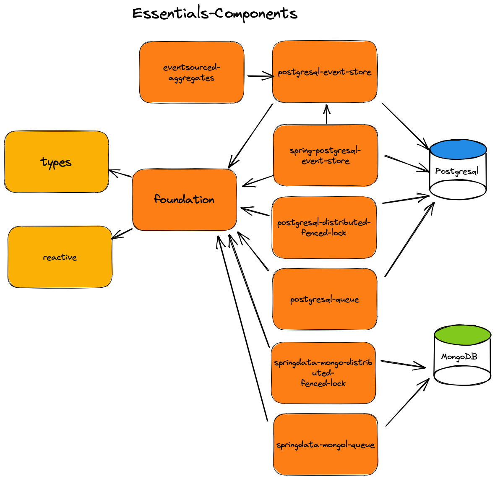

# Essentials Java Components

Essentials Components is a set of Java version 11 (and later) components that are based on
the [Essentials](../README.md) library while providing more complex features
or Components such as `EventStore`, `EventSourced Aggregates`, `FencedLocks`, `DurableQueues`, `DurableLocalCommandbus`, `Inbox` and `Outbox`.



**NOTE:**
**The libraries are WORK-IN-PROGRESS**

# Foundation

This library contains the smallest set of supporting building blocks needed for other Essentials Components libraries,
such as:

- **Identifiers**
    - `CorrelationId`
    - `EventId`
    - `MessageId`
    - `SubscriberId`
    - `Tenant` and `TenantId`
- **Common Interfaces**
    - `Lifecycle`
- **DurableLocalCommandBus** (`CommandBus` variant that uses `DurableQueues` to ensure Commands sent using `sendAndDontWait` aren't lost in case of failure)
- **FencedLock** (For Intra-Service Distributed Locks)
- **PostgreSQL**
    - `ListenNotify`
    - `MultiTableChangeListener`
- **Transactions**
    - `UnitOfWork`
    - `UnitOfWorkFactory`
        - `JdbiUnitOfWorkFactory`
        - Spring
            - `SpringTransactionAwareJdbiUnitOfWorkFactory`
            - `SpringMongoTransactionAwareUnitOfWorkFactory`
- **Queues**
    - `DurableQueues` (For Intra-Service Durable point-to-point messaging)
- **Enterprise Integration Patterns**
    - `Inbox` (Store and Forward supported by a Durable Queue)
    - `Outbox` (Store and Forward supported by a Durable Queue)

To use `foundation` just add the following Maven dependency:

```
<dependency>
    <groupId>dk.cloudcreate.essentials.components</groupId>
    <artifactId>foundation</artifactId>
    <version>0.9.0</version>
</dependency>
```

See [foundation](foundation/README.md)

# Essentials Postgresql: Spring Boot starter
This library Spring Boot auto-configuration for all Postgresql focused Essentials components.
All `@Beans` auto-configured by this library use `@ConditionalOnMissingBean` to allow for easy overriding.

To use `spring-boot-starter-postgresql` to add the following dependency:
```
<dependency>
    <groupId>dk.cloudcreate.essentials.components</groupId>
    <artifactId>spring-boot-starter-postgresql</artifactId>
    <version>0.9.0</version>
</dependency>
```

Per default only the `EssentialsComponentsConfiguration` is auto-configured:
- Jackson/FasterXML JSON modules:
  - `EssentialTypesJacksonModule`
  - `EssentialsImmutableJacksonModule` (if `Objenesis` is on the classpath)
  - `ObjectMapper` with bean name `essentialComponentsObjectMapper` which provides good defaults for JSON serialization
- `Jdbi` to use the provided Spring `DataSource`
- `SpringTransactionAwareJdbiUnitOfWorkFactory` configured to use the Spring provided `PlatformTransactionManager`
  - This `UnitOfWorkFactory` will only be auto-registered if the `SpringTransactionAwareEventStoreUnitOfWorkFactory` is not on the classpath (see `EventStoreConfiguration`)
- `PostgresqlFencedLockManager` using the `essentialComponentsObjectMapper` as JSON serializer
  - Supports additional properties:
  - ```
    essentials.fenced-lock-manager.fenced-locks-table-name=fenced_locks
    essentials.fenced-lock-manager.lock-confirmation-interval=5s
    essentials.fenced-lock-manager.lock-time-out=12s
    ```
- `PostgresqlDurableQueues` using the `essentialComponentsObjectMapper` as JSON serializer
  - Supports additional properties:
  - ```
    essentials.durable-queues.shared-queue-table-name=durable_queues
    ```
- `Inboxes`, `Outboxes` and `DurableLocalCommandBus` configured to use `PostgresqlDurableQueues`
- `LocalEventBus` with bus-name `default` and Bean name `eventBus`
- `ReactiveHandlersBeanPostProcessor` (for auto-registering `EventHandler` and `CommandHandler` Beans with the `EventBus`'s and `CommandBus` beans found in the `ApplicationContext`)
- Automatically calling `Lifecycle.start()`/`Lifecycle.stop`, on any Beans implementing the `Lifecycle` interface, when the `ApplicationContext` is started/stopped

If your project also specifies the
```
<dependency>
    <groupId>dk.cloudcreate.essentials.components</groupId>
    <artifactId>spring-postgresql-event-store</artifactId>
    <version>0.9.0</version>
</dependency>
```
then the `EventStoreConfiguration` will also auto-configure the `EventStore`:
- `PostgresqlEventStore` using `PostgresqlEventStreamGapHandler` (using default configuration)
  - You can configure `NoEventStreamGapHandler` using Spring properties:
  - `essentials.event-store.use-event-stream-gap-handler=false`
- `SeparateTablePerAggregateTypePersistenceStrategy` using `IdentifierColumnType.TEXT` for persisting `AggregateId`'s and `JSONColumnType.JSONB` for persisting Event and EventMetadata JSON payloads
  - ColumnTypes can be overridden by using Spring properties:
  - ```
       essentials.event-store.identifier-column-type=uuid
       essentials.event-store.json-column-type=jsonb
    ```
- `EventStoreUnitOfWorkFactory` in the form of `SpringTransactionAwareEventStoreUnitOfWorkFactory`
- `EventStoreEventBus` with an internal `LocalEventBus` with bus-name `EventStoreLocalBus`
- `PersistableEventMapper` with basic setup. Override this bean if you need additional meta-data, such as event-id, event-type, event-order, event-timestamp, event-meta-data, correlation-id, tenant-id included
- `EventStoreSubscriptionManager` with default `EventStoreSubscriptionManagerProperties` values
  - The default `EventStoreSubscriptionManager` values can be overridden using Spring properties:
  - ```
      essentials.event-store.subscription-manager.event-store-polling-batch-size=5
      essentials.event-store.subscription-manager.snapshot-resume-points-every=2s
      essentials.event-store.subscription-manager.event-store-polling-interval=200
    ```

See [spring-boot-starter-postgresql](spring-boot-starter-postgresql/README.md)

# Essentials MongoDB: Spring Boot starter
This library Spring Boot auto-configuration for all MongoDB focused Essentials components.
All `@Beans` auto-configured by this library use `@ConditionalOnMissingBean` to allow for easy overriding.

To use `spring-boot-starter-mongodb` to add the following dependency:
```
<dependency>
    <groupId>dk.cloudcreate.essentials.components</groupId>
    <artifactId>spring-boot-starter-mongodb</artifactId>
    <version>0.9.0</version>
</dependency>
```

The `EssentialsComponentsConfiguration` auto-configures:
- Jackson/FasterXML JSON modules:
  - `EssentialTypesJacksonModule`
  - `EssentialsImmutableJacksonModule` (if `Objenesis` is on the classpath)
  - `ObjectMapper` with bean name `essentialComponentsObjectMapper` which provides good defaults for JSON serialization
- `SingleValueTypeRandomIdGenerator` to support server generated Id creations for SpringData Mongo classes with @Id fields of type `SingleValueType`
- `MongoCustomConversions` with a `SingleValueTypeConverter` covering `LockName`, `QueueEntryId` and `QueueName`
- `MongoTransactionManager` as it is needed by the `SpringMongoTransactionAwareUnitOfWorkFactory`
- `SpringMongoTransactionAwareUnitOfWorkFactory` configured to use the `MongoTransactionManager`
- `MongoFencedLockManager` using the `essentialComponentsObjectMapper` as JSON serializer
  - Supports additional properties:
  - ```
    essentials.fenced-lock-manager.fenced-locks-collection-name=fenced_locks
    essentials.fenced-lock-manager.lock-confirmation-interval=5s
    essentials.fenced-lock-manager.lock-time-out=12s
    ```
- `MongoDurableQueues` using the `essentialComponentsObjectMapper` as JSON serializer
  - Supports additional properties:
  - ```
    essentials.durable-queues.shared-queue-collection-name=durable_queues
    essentials.durable-queues.transactional-mode=fullytransactional
    # Only relevant if transactional-mode=manualacknowledgement
    # essentials.durable-queues.message-handling-timeout=5s
    ```
- `Inboxes`, `Outboxes` and `DurableLocalCommandBus` configured to use `MongoDurableQueues`
- `LocalEventBus` with bus-name `default` and Bean name `eventBus`
- `ReactiveHandlersBeanPostProcessor` (for auto-registering `EventHandler` and `CommandHandler` Beans with the `EventBus`'s and `CommandBus` beans found in the `ApplicationContext`)
- Automatically calling `Lifecycle.start()`/`Lifecycle.stop`, on any Beans implementing the `Lifecycle` interface, when the `ApplicationContext` is started/stopped


See [spring-boot-starter-mongodb](spring-boot-starter-mongodb/README.md)

# Event Sourced Aggregates

This library focuses on providing different flavours of Event Source Aggregates that are built to work with
the `EventStore` concept.  
The `EventStore` is very flexible and doesn't specify any specific design requirements for an Aggregate or its Events,
except that that have to be associated with an `AggregateType` (see the
`AggregateType` sub section or the `EventStore` section for more information).

This library supports multiple flavours of Aggregate design such as:

- The **modern** `dk.cloudcreate.essentials.components.eventsourced.aggregates.stateful.modern.AggregateRoot`
- The *classic* `dk.cloudcreate.essentials.components.eventsourced.aggregates.stateful.classic.AggregateRoot`
- The *classic* with separate state
  object `dk.cloudcreate.essentials.components.eventsourced.aggregates.stateful.classic.state.AggregateRootWithState`
- The **functional** `dk.cloudcreate.essentials.components.eventsourced.aggregates.flex.FlexAggregate`

The **modern** `AggregateRoot`, *classic* `AggregateRoot` and *classic* `AggregateRootWithState` are all examples of a
mutable `StatefulAggregate` design.

What makes an `Aggregate` design **stateful** is the fact that any changes, i.e. Events applied as the result of calling
command methods on the aggregate instance, are stored within
the `StatefulAggregate` and can be queried using `getUncommittedChanges()` and reset (e.g. after a
transaction/UnitOfWork has completed) using `markChangesAsCommitted()`

Each aggregate loaded or being saved gets associated with the currently active `UnitOfWork`.  
When the `UnitOfWork` is in the commit phase, then the `UnitOfWork` is queries for all changed entities, and the events
stored within the `StatefulAggregate`'s
will be persisted to the `EventStore`.

The `FlexAggregate` follows a functional immutable Aggregate design where each command method returns
the `EventsToPersist` and applying events doesn't alter the state of the aggregate (only rehydration modifies the
aggregate state).

To use `EventSourced Aggregates` just add the following Maven dependency:

```
<dependency>
    <groupId>dk.cloudcreate.essentials.components/groupId>
    <artifactId>eventsourced-aggregates</artifactId>
    <version>0.9.0</version>
</dependency>
```

See [eventsourced-aggregates](eventsourced-aggregates/README.md)

# PostgreSQL Event Store

This library contains a fully featured Event Store that supports persisting Aggregate event streams
into Postgresql.

The primary concept of the EventStore are **Event Streams**   
Definition: An Event Stream is a collection of related Events *(e.g. Order events that are related to Order aggregate
instances)*

It supports the [eventsourced-aggregates](eventsourced-aggregates/README.md) module as well as
advanced concepts such an `EventStoreSubscriptionManager` which supports durable subscriptions, where
the `EventStoreSubscriptionManager` keeps track of the individual subscribers `ResumePoint`'s (similar to
how Kafka keeps track of Consumers Topic offsets).

To use `Postgresql Event Store` just add the following Maven dependency:

```
<dependency>
    <groupId>dk.cloudcreate.essentials.components</groupId>
    <artifactId>postgresql-event-store</artifactId>
    <version>0.9.0</version>
</dependency>
```

See [postgresql-event-store](postgresql-event-store/README.md)

# Spring PostgreSQL Event Store

This library provides the `SpringTransactionAwareEventStoreUnitOfWorkFactory` (as opposed to the
standard `EventStoreManagedUnitOfWorkFactory`)
which allows the `EventStore` to participate in Spring managed Transactions.

```
@SpringBootApplication
class Application {
    @Bean
    public com.fasterxml.jackson.databind.Module essentialJacksonModule() {
        return new EssentialTypesJacksonModule();
    }

    @Bean
    public Jdbi jdbi(DataSource dataSource) {
        Jdbi jdbi = Jdbi.create(new TransactionAwareDataSourceProxy(dataSource));
        return jdbi;
    }
    
    @Bean
    public EventStoreUnitOfWorkFactory unitOfWorkFactory(Jdbi jdbi, PlatformTransactionManager transactionManager) {
        return new SpringTransactionAwareEventStoreUnitOfWorkFactory(jdbi, transactionManager);
    }
}
```

With the `SpringTransactionAwareEventStoreUnitOfWorkFactory` you can either use the `UnitOfWorkFactory` to start and commit Spring transactions, or you can use
the `TransactionTemplate` class or `@Transactional` annotation to start and commit transactions.

No matter how a transaction is started, you can always acquire the active `UnitOfWork` using

```
unitOfWorkFactory.getCurrentUnitOfWork()
```

To use `Spring Postgresql Event Store` just add the following Maven dependency:

```
<dependency>
    <groupId>dk.cloudcreate.essentials.components</groupId>
    <artifactId>spring-postgresql-event-store</artifactId>
    <version>0.9.0</version>
</dependency>
```

See [spring-postgresql-event-store](spring-postgresql-event-store/README.md)

# Distributed Fenced Lock

This library provides a Distributed Locking Manager based of the Fenced Locking concept
described [here](https://martin.kleppmann.com/2016/02/08/how-to-do-distributed-locking.html)  
and comes in two different flavours: `MongoFencedLockManager` and `PostgresqlFencedLockManager`  

The `FencedLockManager` is responsible for obtaining distributed `FencedLock`'s, which are named exclusive locks.  
Only one `FencedLockManager` instance can acquire a `FencedLock` at a time.
The implementation has been on supporting **intra-service** (i.e. across different deployed instances of the **same** service) Lock support through database based implementations (`MongoFencedLockManager` and `PostgresqlFencedLockManager`).  
In a service oriented architecture it's common for all deployed instances of a given service (e.g. a Sales service) to share the same underlying
database(s). As long as the different deployed (Sales) services instances can share the same underlying database, then you use the `FencedLockManager` concept for handling distributed locks across all deployed (Sales service)
instances in the cluster.  
If you need cross-service lock support, e.g. across instances of different services (such as across Sales, Billing and Shipping services), then you need to use a dedicated distributed locking service such as Zookeeper.

See [foundation](foundation/README.md) for more information about how to use the `FencedLockManager`

## PostgresqlFencedLockManager

Provides a `FencedLockManager` implementation using Postgresql to coordinate intra-service distributed locks 

Configuration example:

```
var lockManager = PostgresqlFencedLockManager.builder()
                                      .setJdbi(Jdbi.create(jdbcUrl,
                                                           username,
                                                           password))
                                      .setUnitOfWorkFactory(unitOfWorkFactory)
                                      .setLockTimeOut(Duration.ofSeconds(3))
                                      .setLockConfirmationInterval(Duration.ofSeconds(1))
                                      .buildAndStart(); 
```                                                

To use `PostgreSQL Distributed Fenced Lock` just add the following Maven dependency:

```
<dependency>
    <groupId>dk.cloudcreate.essentials.components</groupId>
    <artifactId>postgresql-distributed-fenced-lock</artifactId>
    <version>0.9.0</version>
</dependency>
```

See [foundation](foundation/README.md) for more information about how to use the `FencedLockManager`  
See [postgresql-distributed-fenced-lock](postgresql-distributed-fenced-lock/README.md) for more information about how to use the `PostgresqlFencedLockManager`

## MongoFencedLockManager

Provides a `FencedLockManager` implementation using MongoDB and the SpringData MongoDB library to coordinate intra-service distributed locks

```
    public MongoFencedLockManager(MongoTemplate mongoTemplate,
                                  MongoConverter mongoConverter,
                                  UnitOfWorkFactory<? extends ClientSessionAwareUnitOfWork> unitOfWorkFactory,
                                  Optional<String> lockManagerInstanceId,
                                  Optional<String> fencedLocksCollectionName,
                                  Duration lockTimeOut,
                                  Duration lockConfirmationInterval) {
      ...
    }
```

Usage example:

```
@Bean
public FencedLockManager fencedLockManager(MongoTemplate mongoTemplate,
                                           MongoConverter mongoConverter,
                                           MongoTransactionManager transactionManager,
                                           MongoDatabaseFactory databaseFactory) {
  return MongoFencedLockManager.builder()
                               .setMongoTemplate(mongoTemplate)
                               .setMongoConverter(mongoConverter)
                               .setUnitOfWorkFactory(new SpringMongoTransactionAwareUnitOfWorkFactory(transactionManager,
                                                                                                      databaseFactory))
                               .setLockTimeOut(Duration.ofSeconds(3))
                               .setLockConfirmationInterval(Duration.ofSeconds(1)))
                               .buildAndStart();
}

@Bean
public SingleValueTypeRandomIdGenerator registerIdGenerator() {
    return new SingleValueTypeRandomIdGenerator();
}

@Bean
public MongoCustomConversions mongoCustomConversions() {
    return new MongoCustomConversions(List.of(
            new SingleValueTypeConverter(LockName.class)));
}

@Bean
public MongoTransactionManager transactionManager(MongoDatabaseFactory databaseFactory) {
    return new MongoTransactionManager(databaseFactory);
}
```

See [foundation](foundation/README.md) for more information about how to use the `FencedLockManager`  
See [springdata-mongo-distributed-fenced-lock](springdata-mongo-distributed-fenced-lock/README.md) for more information about how to use the `MongoFencedLockManager`


## Durable Queue

The `DurableQueues` concept supports intra-service point-to-point messaging using durable Queues that guarantee At-Least-Once delivery of messages. The only requirement is that message producers and message consumers can access
the same underlying durable Queue storage.

This library focuses on providing a Durable Queue supporting message redelivery and Dead Letter Message functionality
and comes in two flavours `PostgresqlDurableQueues` and `MongoDurableQueues` which both implement the `DurableQueues` interface.

In a service oriented architecture it's common for all deployed instances of a given service (e.g. a Sales service) to share the same underlying
database(s). As long as the different deployed (Sales) services instances can share the same underlying database, then you use the `DurableQueues` concept for point-to-point messaging across all deployed (Sales service)
instances in the cluster.  
If you need cross-service point-to-point messaging support, e.g. across instances of different services (such as across Sales, Billing and Shipping services), then you need to use a dedicated distributed Queueing service such as RabbitMQ.

Each Queue is uniquely identified by its `QueueName`.
Durable Queue concept that supports **queuing** a message on to a Queue. Each message is associated with a
unique `QueueEntryId`.

See [foundation](foundation/README.md) for more information about how to use the `DurableQueues`

## PostgresqlDurableQueues

To use `PostgreSQL Durable Queue` just add the following Maven dependency:

```
<dependency>
    <groupId>dk.cloudcreate.essentials.components</groupId>
    <artifactId>postgresql-queue</artifactId>
    <version>0.9.0</version>
</dependency>
```

Example setting up `PostgresqlDurableQueues` (note: you can also use it together with either
the `EventStoreManagedUnitOfWorkFactory` or `SpringManagedUnitOfWorkFactory`):

```
var unitOfWorkFactory = new JdbiUnitOfWorkFactory(jdbi);
var durableQueues = new PostgresqlDurableQueues(unitOfWorkFactory);
durableQueues.start();
```

See [foundation](foundation/README.md) for more information about how to use `PostgresqlDurableQueues` and `DurableQueues`

## MongoDurableQueues

To use `MongoDB Durable Queue` just add the following Maven dependency:

```
<dependency>
    <groupId>dk.cloudcreate.essentials.components</groupId>
    <artifactId>springdata-mongo-queue</artifactId>
    <version>0.9.0</version>
</dependency>
```

Example setting up `MongoDurableQueues`:

```
    @Bean
    public SingleValueTypeRandomIdGenerator registerIdGenerator() {
        return new SingleValueTypeRandomIdGenerator();
    }

    @Bean
    public MongoCustomConversions mongoCustomConversions() {
        return new MongoCustomConversions(List.of(
                new SingleValueTypeConverter(QueueEntryId.class,
                                             QueueName.class)));
    }

    @Bean
    public MongoTransactionManager transactionManager(MongoDatabaseFactory databaseFactory) {
        return new MongoTransactionManager(databaseFactory);
    }


    @Bean
    MongoTemplate mongoTemplate(MongoDatabaseFactory mongoDbFactory, MongoConverter converter) {
        MongoTemplate mongoTemplate = new MongoTemplate(mongoDbFactory, converter);
        mongoTemplate.setWriteConcern(WriteConcern.ACKNOWLEDGED);
        mongoTemplate.setWriteResultChecking(WriteResultChecking.EXCEPTION);
        return mongoTemplate;
    }
```

See [foundation](foundation/README.md) for more information about how to use `MongoDurableQueues` and `DurableQueues`

