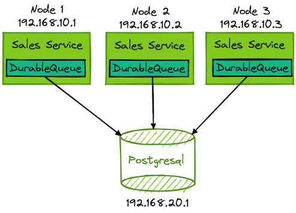
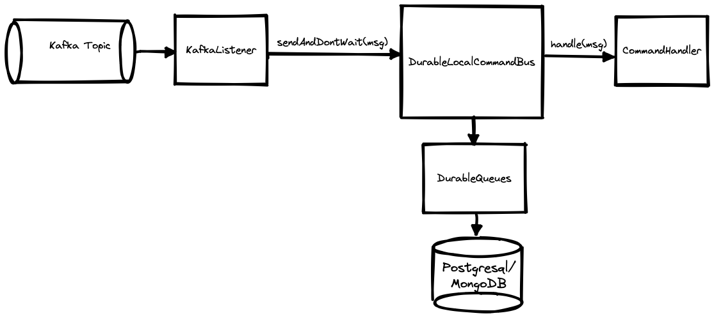
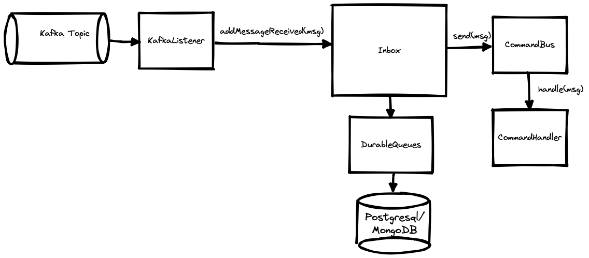
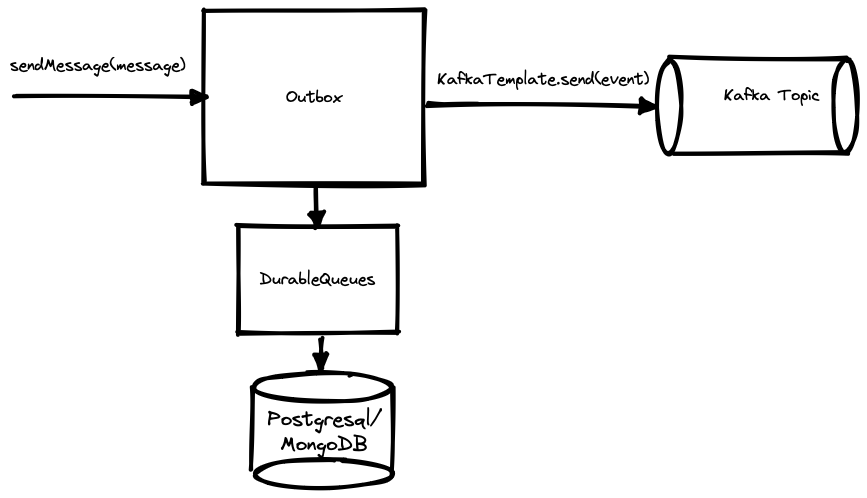
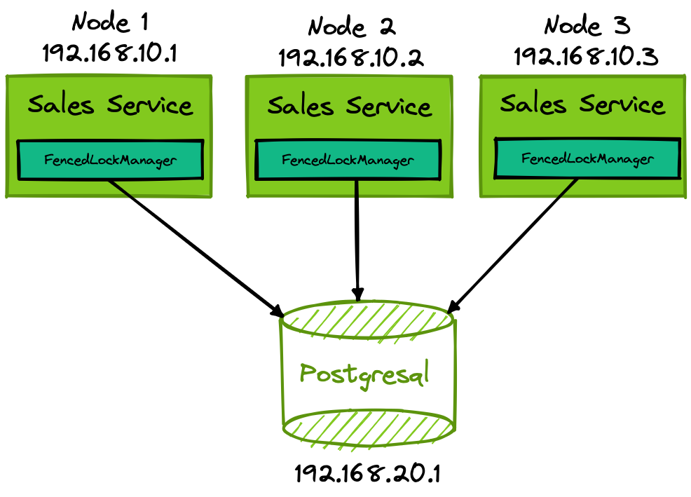

# Essentials Components - Foundation

This library focuses purely on providing common types and foundational patterns, such as queue, inbox, outbox, etc. used in modern java solutions:

- **Identifiers**
    - `CorrelationId`
    - `EventId`
    - `MessageId`
    - `SubscriberId`
    - `Tenant` and `TenantId`
- **Common Interfaces**
    - `Lifecycle`
- **DurableLocalCommandBus** (`CommandBus` variant that uses `DurableQueues` to ensure Commands sent using `sendAndDontWait` aren't lost in case of failure)
- **FencedLock**
- **PostgreSQL**
    - `ListenNotify`
    - `MultiTableChangeListener`
- **Transactions**
    - `UnitOfWork`
    - `UnitOfWorkFactory`
        - `JdbiUnitOfWorkFactory`
        - Spring
            - `SpringTransactionAwareJdbiUnitOfWorkFactory`
            - `SpringMongoTransactionAwareUnitOfWorkFactory`
- **Queues**
    - `DurableQueues`
- **Enterprise Integration Patterns**
    - `Inbox` (Store and Forward supported by a Durable Queue)
    - `Outbox` (Store and Forward supported by a Durable Queue)

To use `foundation` just add the following Maven dependency:

```xml

<dependency>
    <groupId>dk.cloudcreate.essentials.components</groupId>
    <artifactId>foundation</artifactId>
    <version>0.9.16</version>
</dependency>
```

## DurableQueues

The `DurableQueues` concept supports intra-service point-to-point messaging using durable Queues that guarantee At-Least-Once delivery of messages. The only requirement is that message producers and message consumers can access
the same underlying durable Queue storage.

In a service oriented architecture it's common for all deployed instances of a given service (e.g. a Sales service) to share the same underlying
database(s). As long as the different deployed (Sales) services instances can share the same underlying database, then you use the `DurableQueues` concept for point-to-point messaging across all deployed (Sales service)
instances in the cluster.  


If you need cross-service point-to-point messaging support, e.g. across instances of different services (such as across Sales, Billing and Shipping services), then you need to use a dedicated distributed Queueing service such as RabbitMQ.

This library focuses on providing a Durable Queue supporting message redelivery and Dead Letter Message functionality
and comes in two flavours  
`PostgresqlDurableQueues` and `MongoDurableQueues` which both implement the `DurableQueues` interface.

Each Queue is uniquely identified by its `QueueName`.
Durable Queue concept that supports **queuing** a `Message` on to a Queue. Each message is associated with a
unique `QueueEntryId`.

### Ordered Messages
If you're queuing with `OrderedMessage` then, IF and only IF,  only a single cluster node is consuming from the Queue, 
such as with an `Inbox` or `Outbox` configured with `MessageConsumptionMode#SingleGlobalConsumer` (which uses a FencedLock to 
coordinate message consumption across cluster nodes)
in order to be able to guarantee that `OrderedMessage`'s are delivered in `OrderedMessage#order` per `OrderedMessage#key`
across as many `numberOfParallelMessageConsumers` as you wish to use.

### Transactional Queueing of a Message (supported by `PostgresqlDurableQueues` and `MongoDurableQueues`)

```
var queueName = QueueName.of("SomeQueue");
var someMessage = new SomeMessage(...);
QueueEntryId msgId = unitOfWorkFactory.withUnitOfWork(() -> durableQueues.queueMessage(queueName,
                                                                                       someMessage));
```

### Non-Transactional Queueing of a Message (supported by `MongoDurableQueues`):

```
var queueEntryId = durableQueues.queueMessage(QueueName.of("TestQueue"),
                                              new OrderEvent.OrderAccepted(OrderId.random()));
```

The `DurableQueues` supports competing consumers, such that different service instances across a cluster can compete to consume from the same Queue.
The different `DurableQueues` operations (such as `QueueMessage`, `RetryMessage`, etc.) can be intercepted or modified by `DurableQueuesInterceptor`'s.

Queued messages can, per Queue, asynchronously be consumed by a `QueuedMessageHandler`, by registering it as a `DurableQueueConsumer`
using `DurableQueues#consumeFromQueue(ConsumeFromQueue)`

The `DurableQueues` supports delayed message delivery as well as **Poison-Message/Dead-Letter-Messages**, which are messages that have
been marked as a **Dead Letter Messages** (due to an error processing the
message).  
Dead Letter Messages won't be delivered to a `DurableQueueConsumer`, unless you
call `DurableQueues#resurrectDeadLetterMessage(ResurrectDeadLetterMessage)` (or run a database script)

The `DurableQueueConsumer` supports retrying failed messages, according to the specified `RedeliveryPolicy`, and
ultimately marking a repeatedly failing message as a **Poison-Message/Dead-Letter-Message**.
The  `RedeliveryPolicy` supports many redeliveries patterns, such as **Linear**-, **Fixed**- and **Exponential**-**Backoff**.  
Through the `RedeliveryPolicy`'s `MessageDeliveryErrorHandler` you can control which exceptions should result in a message instantly
being marked as a **Poison-Message/Dead-Letter-Message**.

### Consume Message example

```
var consumer = durableQueues.consumeFromQueue(ConsumeFromQueue.builder()
                                                              .setQueueName(queueName)
                                                              .setRedeliveryPolicy(
                                                                      RedeliveryPolicy.fixedBackoff()
                                                                                      .setRedeliveryDelay(Duration.ofMillis(200))
                                                                                      .setMaximumNumberOfRedeliveries(5)
                                                                                      .setDeliveryErrorHandler(MessageDeliveryErrorHandler.stopRedeliveryOn(ValidationException.class))
                                                                                      .build())
                                                              .setParallelConsumers(1)
                                                              .setQueueMessageHandler(QueuedMessage message -> {
                                                                  // Handle message
                                                               })
                                                              .build());
                                                              
// When you're done with the consumer then you can call cancel 
// Alternatively you can call durableQueues.stop() during service/application shutdown and it will cancel and remove the consumer
consumer.cancel();
```

You can also provide a subtype of `PatternMatchingQueuedMessageHandler` which supports pattern matching on the `Message#payload` contained in the `QueuedMessage`'s:
```
var consumer = durableQueues.consumeFromQueue(ConsumeFromQueue.builder()
                                                              .setQueueName(queueName)
                                                              .setRedeliveryPolicy(
                                                                      RedeliveryPolicy.fixedBackoff()
                                                                                      .setRedeliveryDelay(Duration.ofMillis(200))
                                                                                      .setMaximumNumberOfRedeliveries(5)
                                                                                      .setDeliveryErrorHandler(MessageDeliveryErrorHandler.stopRedeliveryOn(ValidationException.class))
                                                                                      .build())
                                                              .setParallelConsumers(1)
                                                              .setQueueMessageHandler(new PatternMatchingQueuedMessageHandler() {
                                                                                        @MessageHandler
                                                                                        void handle(SomeCommand someCommand) {
                                                                                        }
                                                                                
                                                                                        @MessageHandler
                                                                                        void handle(SomeOtherCommand someOtherCommand, QueuedMessage queuedMessageForSomeOtherCommand) {
                                                                                        }
                                                                                
                                                                                        @Override
                                                                                        protected void handleUnmatchedMessage(QueuedMessage queuedMessage) {
                                                                                        }
                                                                                    })
                                                              .build());
```

To use `DurableQueues` you must create an instance of a concrete `DurableQueues` implementation, such as `PostgresqlDurableQueues` or `MongoDurableQueues`.

### `PostgresqlDurableQueues`

To use `PostgresqlDurableQueues` you must include dependency

```xml

<dependency>
    <groupId>dk.cloudcreate.essentials.components</groupId>
    <artifactId>postgresql-queue</artifactId>
    <version>0.9.16</version>
</dependency>
```

Example standalone configuration:

```
var unitOfWorkFactory = new JdbiUnitOfWorkFactory(jdbi);
var durableQueues = new PostgresqlDurableQueues(unitOfWorkFactory);
durableQueues.start();
```

Example Spring configuration:

```
@Bean
public DurableQueues durableQueues(HandleAwareUnitOfWorkFactory<? extends HandleAwareUnitOfWork> unitOfWorkFactory) {
    return new PostgresqlDurableQueues(unitOfWorkFactory);
}

@Bean
public Jdbi jdbi(DataSource dataSource) {
    var jdbi = Jdbi.create(new TransactionAwareDataSourceProxy(dataSource));
    jdbi.installPlugin(new PostgresPlugin());
    return jdbi;
}

@Bean
public EventStoreUnitOfWorkFactory<? extends EventStoreUnitOfWork> unitOfWorkFactory(Jdbi jdbi,
                                                                                     PlatformTransactionManager transactionManager) {
    return new SpringTransactionAwareJdbiUnitOfWorkFactory(jdbi, transactionManager);
}

@Bean
public com.fasterxml.jackson.databind.Module essentialJacksonModule() {
    return new EssentialTypesJacksonModule();
}
```

### `MongoDurableQueues`

To use `MongoDurableQueues` you must include dependency

```xml

<dependency>
    <groupId>dk.cloudcreate.essentials.components</groupId>
    <artifactId>springdata-mongo-queue</artifactId>
    <version>0.9.16</version>
</dependency>
```

Next you need to decide on which `TransactionalMode` to run the `MongoDurableQueues` in.

### FullyTransactional

When using this mode all the queueing, de-queueing methods requires an existing `UnitOfWork`
started prior to being called. The reason for this is that Queues are typically used together with the `Inbox` or
`Outbox` pattern, which benefits from including queueing/de-queueing together with other database entity modifying
operations.  
When changing an entity and queueing/de-queueing happens in ONE shared transaction *(NOTE this requires that the entity
storage and the queue storage
to use the same MongoDB database) then the shared database transaction guarantees that all the data storage operations
are committed or rollback as one

Example `TransactionalMode#FullyTransactional` Spring configuration:

```
@Bean
public DurableQueues durableQueues(MongoTemplate mongoTemplate, 
                                   SpringMongoTransactionAwareUnitOfWorkFactory unitOfWorkFactory) {
    return new MongoDurableQueues(mongoTemplate,
                                      unitOfWorkFactory);
}
        
@Bean
public SingleValueTypeRandomIdGenerator registerIdGenerator() {
    return new SingleValueTypeRandomIdGenerator();
}

@Bean
public MongoCustomConversions mongoCustomConversions() {
    return new MongoCustomConversions(List.of(
            new SingleValueTypeConverter(QueueEntryId.class,
                                         QueueName.class)));
}

@Bean
public MongoTransactionManager transactionManager(MongoDatabaseFactory databaseFactory) {
    TransactionOptions transactionOptions = TransactionOptions.builder()
                                                              .readConcern(ReadConcern.SNAPSHOT)
                                                              .writeConcern(WriteConcern.ACKNOWLEDGED)
                                                              .build();
    return new MongoTransactionManager(databaseFactory, transactionOptions);
}

@Bean
MongoTemplate mongoTemplate(MongoDatabaseFactory mongoDbFactory, MongoConverter converter) {
    MongoTemplate mongoTemplate = new MongoTemplate(mongoDbFactory, converter);
    mongoTemplate.setWriteConcern(WriteConcern.ACKNOWLEDGED);
    mongoTemplate.setWriteResultChecking(WriteResultChecking.EXCEPTION);
    return mongoTemplate;
}

@Bean
public com.fasterxml.jackson.databind.Module essentialJacksonModule() {
    return new EssentialTypesJacksonModule();
}
```

### SingleOperationTransaction

MongoDB/DocumentDB have some limitations when performing multiple data storage operations within a transaction (such as
querying large collections returning large numbers of Documents).   
Running this mode is also useful for Long-running message handling,
For these cases you can configure the `TransactionalMode` as `SingleOperationTransaction` where queueing and de-queueing are
performed using separate single document
transactions and where acknowledging/retry are also performed as separate transactions.  
Depending on the type of errors that can occur this MAY leave a dequeued message
in a state of being marked as "being delivered" forever. Hence `MongoDurableQueues` supports periodically
discovering messages that have been under delivery for a long time (aka. stuck messages or timed-out messages) and will
reset them in order for them to be redelivered.

Example `TransactionalMode#SingleOperationTransaction` Spring configuration:

```
@Bean
public DurableQueues durableQueues(MongoTemplate mongoTemplate) {
    return new MongoDurableQueues(mongoTemplate,
                                  Duration.ofSeconds(10));
}
        
@Bean
public SingleValueTypeRandomIdGenerator registerIdGenerator() {
    return new SingleValueTypeRandomIdGenerator();
}

@Bean
public MongoCustomConversions mongoCustomConversions() {
    return new MongoCustomConversions(List.of(
            new SingleValueTypeConverter(QueueEntryId.class,
                                         QueueName.class)));
}

@Bean
MongoTemplate mongoTemplate(MongoDatabaseFactory mongoDbFactory, MongoConverter converter) {
    MongoTemplate mongoTemplate = new MongoTemplate(mongoDbFactory, converter);
    mongoTemplate.setWriteConcern(WriteConcern.ACKNOWLEDGED);
    mongoTemplate.setWriteResultChecking(WriteResultChecking.EXCEPTION);
    return mongoTemplate;
}

@Bean
public com.fasterxml.jackson.databind.Module essentialJacksonModule() {
    return new EssentialTypesJacksonModule();
}
```

Using TransactionalMode#SingleOperationTransaction (if consuming messages manually without using `DurableQueues.consumeFromQueue(ConsumeFromQueue)`):

```
durableQueues.queueMessage(queueName, message);
var msgUnderDelivery = durableQueues.getNextMessageReadyForDelivery(queueName);
if (msgUnderDelivery.isPresent()) {
   try {
      handleMessage(msgUnderDelivery.get());
      durableQueues.acknowledgeMessageAsHandled(msgUnderDelivery.get().getId());
   } catch (Exception e) {
      durableQueues.retryMessage(msgUnderDelivery.get().getId(), 
                                 e,
                                 Duration.ofMillis(500));
   }
}
```

## `DurableLocalCommandBus`

Provides a JVM local and durable, in regard to `sendAndDontWait(Object)/sendAndDontWait(Object, Duration))`, variant of the `CommandBus` concept Durability for
`sendAndDontWait(Object)/sendAndDontWait(Object, Duration))` is delegated to `DurableQueues`.  
What `QueueName` that is used during `sendAndDontWait` is determined by the `CommandQueueNameSelector` and the `RedeliveryPolicy` is determined by the `CommandQueueRedeliveryPolicyResolver`.
The `SendAndDontWaitErrorHandler` allows custom error handling of `CommandHandler` exceptions.  
If the `SendAndDontWaitErrorHandler` provided doesn't rethrow the exception, then the underlying `DurableQueues` will not be able to retry the command.  
Due to this the `DurableLocalCommandBus` defaults to using the `RethrowingSendAndDontWaitErrorHandler`



### Simple configuration example using defaults:
```
var commandBus = DurableLocalCommandBus.builder()
                                       .setDurableQueues(durableQueues)
                                       .build();
```

### Full configuration example:
```
var commandBus = DurableLocalCommandBus.builder()
                                       .setDurableQueues(durableQueues)
                                       .setSendAndDontWaitErrorHandler(new SendAndDontWaitErrorHandler.RethrowingSendAndDontWaitErrorHandler())
                                       .setCommandQueueNameSelector(CommandQueueNameSelector.sameCommandQueueForAllCommands(QueueName.of("DefaultCommandQueue")))
                                       .setCommandQueueRedeliveryPolicyResolver(CommandQueueRedeliveryPolicyResolver.sameReliveryPolicyForAllCommandQueues(RedeliveryPolicy.fixedBackoff()
                                                                                                                                                                          .setRedeliveryDelay(Duration.ofMillis(150))
                                                                                                                                                                          .setMaximumNumberOfRedeliveries(20)
                                                                                                                                                                          .build()))
                                       .setParallelSendAndDontWaitConsumers(20)
                                       .setInterceptors(new UnitOfWorkControllingCommandBusInterceptor(unitOfWorkFactory))
                                       .build();
```

Using the `DurableLocalCommandBus` follows the API and principles described for the `CommandBus`/`LocalCommandBus` under `essentials-reactive`.

## Inbox

Foundation contains support for the `Inbox` concept through the high level `Inboxes` concept.

The `Inbox` supports the transactional **Store and Forward pattern** from **Enterprise Integration Patterns** supporting **At-Least-Once delivery guarantee**.  
The `Inbox` pattern is used to handle incoming messages from a message infrastructure (such as a Queue, Kafka, EventBus, etc).  
The message is added to the `Inbox` in a transaction/UnitOfWork and afterwards the message is Acknowledged (ACK) with the message infrastructure the UnitOfWork is committed.  
If the ACK fails then the message infrastructure will attempt to redeliver the message even if the UnitOfWork has been committed, since the message infrastructure and the
Inbox don't share the same transactional resource. This means that messages received from the message infrastructure can be added more than once to the Inbox.  
After the UnitOfWork has been committed, the messages will be asynchronously delivered to the message consumer in a new UnitOfWork.  
The `Inbox` itself supports Message Redelivery in case the Message consumer experiences failures. This means that the Message consumer, registered with the Inbox,
can and will receive Messages more than once and therefore its message handling has to be idempotent.

The `Inboxes` concept is supported by the `DurableQueues` concept and requires a concrete `DurableQueues` implementation, such as
`PostgresqlDurableQueues` or `MongoDurableQueues` (see configuration example above).



The `Inboxes` concept supports two different `MessageConsumptionMode`'s:

- `SingleGlobalConsumer`: Only a single consumer instance in a cluster will be allowed to consume messages at a time (supports failover if the given consumer is shutdown or crashes)
- `GlobalCompetingConsumers`: Multiple consumers in a cluster can compete to handle messages, but a message will only be handled a single consumer

To support `SingleGlobalConsumer` the `Inboxes` logic needs to be configured with an instance of a `FencedLockManager` (see configuration further below).

### Ordered Messages
If you're working with `OrderedMessage`'s then the `Inbox` consumer must be configured
with `InboxConfig#getMessageConsumptionMode()` having value `MessageConsumptionMode#SingleGlobalConsumer`
in order to be able to guarantee that `OrderedMessage`'s are delivered in `OrderedMessage#getOrder()` per `OrderedMessage#getKey()`
across as many `InboxConfig#numberOfParallelMessageConsumers` as you wish to use.

If an `OrderedMessage` is delivered via an `Inbox` using a `FencedLock` (such as
the `Inboxes#durableQueueBasedInboxes(DurableQueues, FencedLockManager)`)
to coordinate message consumption, then you can find the `FencedLock#getCurrentToken()`
of the consumer in the `Message#getMetaData()` under key `MessageMetaData#FENCED_LOCK_TOKEN`

### `Inboxes` Spring configuration

```
@Bean
public Inboxes inboxes(DurableQueues durableQueues, FencedLockManager fencedLockManager) {
    return Inboxes.durableQueueBasedInboxes(durableQueues,
                                            fencedLockManager);
}
```

### Configuring a concrete `Inbox`:

```
Inbox orderEventsInbox = inboxes.getOrCreateInbox(InboxConfig.builder()
                                                               .inboxName(InboxName.of("OrderService:OrderEvents"))
                                                               .redeliveryPolicy(RedeliveryPolicy.fixedBackoff()
                                                                                                 .setRedeliveryDelay(Duration.ofMillis(100))
                                                                                                 .setMaximumNumberOfRedeliveries(10)
                                                                                                 .build())
                                                               .messageConsumptionMode(MessageConsumptionMode.SingleGlobalConsumer)
                                                               .numberOfParallelMessageConsumers(5)
                                                               .build(),
                                                               (Message shipOrderMessage) -> {
                                                                   // Handle message
                                                               }); 
```

You can also provide a subtype of `PatternMatchingMessageHandler` which supports pattern matching on the `Message#payload`:
```
Inbox orderEventsInbox = inboxes.getOrCreateInbox(InboxConfig.builder()
                                                               .inboxName(InboxName.of("OrderService:OrderEvents"))
                                                               .redeliveryPolicy(RedeliveryPolicy.fixedBackoff()
                                                                                                 .setRedeliveryDelay(Duration.ofMillis(100))
                                                                                                 .setMaximumNumberOfRedeliveries(10)
                                                                                                 .build())
                                                               .messageConsumptionMode(MessageConsumptionMode.SingleGlobalConsumer)
                                                               .numberOfParallelMessageConsumers(5)
                                                               .build(),
                                                               new PatternMatchingMessageHandler() {
                                                                    @MessageHandler
                                                                    void handle(SomeCommand someCommand) {
                                                                    }
                                                            
                                                                    @MessageHandler
                                                                    void handle(SomeOtherCommand someOtherCommand, Message messageForSomeOtherCommand) {
                                                                    }
                                                            
                                                                    @Override
                                                                    protected void handleUnmatchedMessage(Message message) {
                                                                    }
                                                                }); 

```

### Adding a message to an `Inbox` from a Spring KafkaListener:

```
@KafkaListener(topics = ORDER_EVENTS_TOPIC_NAME, groupId = "order-processing", containerFactory = "kafkaListenerContainerFactory")
public void handle(OrderEvent event) {
    if (event instanceof OrderAccepted) {
        orderEventsInbox.addMessageReceived(new ShipOrder(event.getId()));
    } 
}
```

### Configuring an `Inbox` to forward onto a `CommandBus`:

`Inboxes` also supports forwarding messages directly onto an instance of the `CommandBus` concept (such as `LocalCommandBus`)

```
Inbox orderEventsInbox = inboxes.getOrCreateInbox(InboxConfig.builder()
                                                               .inboxName(InboxName.of("OrderService:OrderEvents"))
                                                               .redeliveryPolicy(RedeliveryPolicy.fixedBackoff()
                                                                                                 .setRedeliveryDelay(Duration.ofMillis(100))
                                                                                                 .setMaximumNumberOfRedeliveries(10)
                                                                                                 .build())
                                                               .messageConsumptionMode(MessageConsumptionMode.SingleGlobalConsumer)
                                                               .numberOfParallelMessageConsumers(5)
                                                               .build(),
                                                                commandBus; 
```

### Alternatively use the `DurableLocalCommandBus`
Alternatively, if you're using a `DurableLocalCommandBus`, then you can just forward messages directly onto the `DurableLocalCommandBus` by calling `sendAndDontWait`.
Internally `DurableLocalCommandBus`'s  `sendAndDontWait` operation also uses the `DurableQueues` concept to ensure that
commands send have guaranteed delivery:

```
DurableLocalCommandBus durableCommandBus;

@KafkaListener(topics = ORDER_EVENTS_TOPIC_NAME, groupId = "order-processing", containerFactory = "kafkaListenerContainerFactory")
public void handle(OrderEvent event) {
    if (event instanceof OrderAccepted) {
        durableCommandBus.sendAndDontWait(new ShipOrder(event.getId()));
    } 
}
```

## Outbox

Foundation contains support for the `Outbox` concept through the high level `Outboxes` concept.

The `Outbox` supports the transactional **Store and Forward pattern** from **Enterprise Integration Patterns** supporting **At-Least-Once delivery guarantee**.   
The `Outbox` pattern is used to handle outgoing messages, that are created as a side effect of adding/updating an entity in a database, but where the message infrastructure
(such as a Queue, Kafka, EventBus, etc) that doesn't share the same underlying transactional resource as the database.  
Instead, you need to use an `Outbox` that can join in the same UnitOfWork/transactional-resource that the database is using.  
The message is added to the `Outbox` in a transaction/UnitOfWork and afterwards the UnitOfWork is committed.  
If the transaction fails then both the entity and the message will be rolled back when then UnitOfWork rolls back.  
After the UnitOfWork has been committed, the messages will be asynchronously delivered to the message consumer in a new UnitOfWork.  
The `Outbox` itself supports Message Redelivery in case the Message consumer experiences failures.  
This means that the Message consumer, registered with the Outbox, can and will receive Messages more than once and therefore its message handling has to be idempotent.

The `Outboxes` concept is supported by the `DurableQueues` concept and requires a concrete `DurableQueues` implementation, such as
`PostgresqlDurableQueues` or `MongoDurableQueues` (see configuration example above).



The `Outboxes` concept supports two different `MessageConsumptionMode`'s:

- `SingleGlobalConsumer`: Only a single consumer instance in a cluster will be allowed to consume messages at a time (supports failover if the given consumer is shutdown or crashes)
- `GlobalCompetingConsumers`: Multiple consumers in a cluster can compete to handle messages, but a message will only be handled a single consumer

To support `SingleGlobalConsumer` the `Outboxes` logic needs to be configured with an instance of a `FencedLockManager` (see configuration further below).

### Ordered Messages
If you're working with `OrderedMessage`'s then the `Outbox` consumer must be configured
with `OutboxConfig#getMessageConsumptionMode()` having value `MessageConsumptionMode#SingleGlobalConsumer`
in order to be able to guarantee that `OrderedMessage`'s are delivered in `OrderedMessage#getOrder()` per `OrderedMessage#getKey()`
across as many `OutboxConfig#numberOfParallelMessageConsumers` as you wish to use.

If an `OrderedMessage` is delivered via an `Outbox` using a `FencedLock` (such as
the `Outboxes#durableQueueBasedOutboxes(DurableQueues, FencedLockManager)`)
to coordinate message consumption, then you can find the `FencedLock#getCurrentToken()`
of the consumer in the `Message#getMetaData()` under key `MessageMetaData#FENCED_LOCK_TOKEN`

### `Outboxes` Spring configuration

```
@Bean
public Outboxes outboxes(DurableQueues durableQueues, FencedLockManager fencedLockManager) {
    return Outboxes.durableQueueBasedOutboxes(durableQueues,
                                              fencedLockManager);
}
```

### Configuring a concrete `Outbox`:

```
Outbox kafkaOutbox = outboxes.getOrCreateOutbox(OutboxConfig.builder()
                                                         .setOutboxName(OutboxName.of("ShippingOrder:KafkaShippingEvents"))
                                                         .setRedeliveryPolicy(RedeliveryPolicy.fixedBackoff(Duration.ofMillis(100), 10))
                                                         .setMessageConsumptionMode(MessageConsumptionMode.SingleGlobalConsumer)
                                                         .setNumberOfParallelMessageConsumers(1)
                                                         .build(),
                                                         (Message externalOrderShippingEventMessage) -> {
                                                             var producerRecord = new ProducerRecord<String, Object>(SHIPPING_EVENTS_TOPIC_NAME,
                                                                                                                     e.getPayload().orderId.toString(),
                                                                                                                     e.getPayload().);
                                                             kafkaTemplate.send(producerRecord);
                                                         });
```

You can also provide a subtype of `PatternMatchingMessageHandler` which supports pattern matching on the `Message#payload`:
```
Outbox kafkaOutbox = outboxes.getOrCreateOutbox(OutboxConfig.builder()
                                                         .setOutboxName(OutboxName.of("ShippingOrder:KafkaShippingEvents"))
                                                         .setRedeliveryPolicy(RedeliveryPolicy.fixedBackoff(Duration.ofMillis(100), 10))
                                                         .setMessageConsumptionMode(MessageConsumptionMode.SingleGlobalConsumer)
                                                         .setNumberOfParallelMessageConsumers(1)
                                                         .build(),
                                                          new PatternMatchingMessageHandler() {
    
                                                                @MessageHandler
                                                                void handle(SomeCommand someCommand) {
                                                                }
                                                        
                                                                @MessageHandler
                                                                void handle(SomeOtherCommand someOtherCommand, Message messageForSomeOtherCommand) {
                                                                }
                                                        
                                                                @Override
                                                                protected void handleUnmatchedMessage(Message message) {
                                                                }
                                                            }); 
```

### Adding a message to an `Outbox`

```
unitOfWorkFactory.usingUnitOfWork(() -> kafkaOutbox.sendMessage(new ExternalOrderShipped(e.orderId)));
```

# Distributed Fenced Locks

This library provides a Distributed Locking Manager based of the Fenced Locking concept
described [here](https://martin.kleppmann.com/2016/02/08/how-to-do-distributed-locking.html)  
and comes in two different flavours: `MongoFencedLockManager` and `PostgresqlFencedLockManager`

A `FencedLockManager` is responsible for obtaining distributed `FencedLock`'s, which are named exclusive locks.  
Only one `FencedLockManager` instance can acquire a `FencedLock` at a time.
The implementation has been on supporting **intra-service** (i.e. across different deployed instances of the **same** service) Lock support through database based implementations (`MongoFencedLockManager` and `PostgresqlFencedLockManager`).  
In a service oriented architecture it's common for all deployed instances of a given service (e.g. a Sales service) to share the same underlying
database(s). As long as the different deployed (Sales) services instances can share the same underlying database, then you use the `FencedLockManager` concept for handling distributed locks across all deployed (Sales service) 
instances in the cluster.  


If you need cross-service lock support, e.g. across instances of different services (such as across Sales, Billing and Shipping services), then you need to use a dedicated distributed locking service such as Zookeeper.

To coordinate this properly it's important that each `getLockManagerInstanceId()` is unique across the cluster.  
Per default it uses the local machine hostname as `getLockManagerInstanceId()` value.

The common interfaces across the different implementations are `FencedLockManager`, `FencedLock` and `LockCallback`.

### Using distributed Fenced locks

`FencedLockManager` is supported by both `MongoFencedLockManager` and `PostgresqlFencedLockManager` which are used in the
same way:

```
FencedLockManager lockManager = ....;
lockManager.start();
```

## Synchronous lock acquiring

Example using synchronous FencedLock acquiring:

```
var lockName = LockName.of("MyLock");

// Blocking wait to acquire the lock
FencedLock lockNode = lockManager.acquireLock(lockName);
// Do work
...
// Release lock
lock.release();

// Blocking with try using
try (FencedLock lockNode = lockManager.acquireLock(lockName)) {
  // Do work
  ...
}

// or you can try acquiring the lock. This returns an Optional with the lock if acquired or Optional.empty if the lock couldn't be acquired
Optional<FencedLock> potentialAcquiredLock = lockManager.tryAcquireLock(lockName);
Optional<FencedLock> potentialAcquiredLock = lockManager.tryAcquireLock(lockName, Duration.ofSeconds(2));
potentialAcquiredLock.ifPresent(lock -> {
   // Do work
   ...
   lock.release();
});
```

## Asynchronous lock acquiring

The most common case is asynchronous Lock acquiring where a background process attempts to acquire a lock.
If an acquired lock is lost/released, then the background process will keep reattempting to acquire a lock.

```
lockManager.acquireLockAsync(LockName.of("MyLock"), 
                             new LockCallback() {
        @Override
        public void lockAcquired(FencedLock lock) {
            // lock.getCurrentToken() provides the current token.
            // This token can be forwarded to allow other code to figure out if a request comes from a lock holder with a stale lock.
            // Example: A downstream logic receives a request from this instance with a token value 8. 
            // If in the mean time the same downstream logic has received a request from another
            // instance with a value > 8, then it can choose to ignore any requests with a token value < than the 
            // highest received token value, as these request must come from a lock holder with a stale lock
        }

        @Override
        public void lockReleased(FencedLock lock) {
           // Lock release can happen voluntarily or if another node determines that the lock is stale and
           // there for acquires the lock
        }
    });
```

## PostgresqlFencedLockManager

An implementation using Postgresql to coordinate the different locks

```
@Bean
public FencedLockManager fencedLockManager(Jdbi jdbi, HandleAwareUnitOfWorkFactory<? extends HandleAwareUnitOfWork> unitOfWorkFactory) {
    return PostgresqlFencedLockManager.builder()
                                      .setJdbi(jdbi)
                                      .setUnitOfWorkFactory(unitOfWorkFactory)
                                      .setLockTimeOut(Duration.ofSeconds(3))
                                      .setLockConfirmationInterval(Duration.ofSeconds(1))
                                      .buildAndStart();
}
```

Configuration example:

```
var lockManager = PostgresqlFencedLockManager.builder()
                                      .setJdbi(Jdbi.create(jdbcUrl,
                                                           username,
                                                           password))
                                      .setUnitOfWorkFactory(unitOfWorkFactory)
                                      .setLockTimeOut(Duration.ofSeconds(3))
                                      .setLockConfirmationInterval(Duration.ofSeconds(1))
                                      .buildAndStart(); 
```                                                

To use `PostgreSQL Distributed Fenced Lock` just add the following Maven dependency:

```
<dependency>
    <groupId>dk.cloudcreate.essentials.components</groupId>
    <artifactId>postgresql-distributed-fenced-lock</artifactId>
    <version>0.9.16</version>
</dependency>
```

## MongoFencedLockManager

An implementation using MongoDB and the SpringData MongoDB library to coordinate the different locks:

```
@Bean
public FencedLockManager fencedLockManager(MongoTemplate mongoTemplate,
                                           MongoConverter mongoConverter,
                                           SpringMongoTransactionAwareUnitOfWorkFactory unitOfWorkFactory) {
  return MongoFencedLockManager.builder()
                               .setMongoTemplate(mongoTemplate)
                               .setMongoConverter(mongoConverter)
                               .setUnitOfWorkFactory(unitOfWorkFactory)
                               .setLockTimeOut(Duration.ofSeconds(3))
                               .setLockConfirmationInterval(Duration.ofSeconds(1)))
                               .buildAndStart();
}

@Bean
public SingleValueTypeRandomIdGenerator registerIdGenerator() {
    return new SingleValueTypeRandomIdGenerator();
}

@Bean
public MongoCustomConversions mongoCustomConversions() {
    return new MongoCustomConversions(List.of(
            new SingleValueTypeConverter(LockName.class)));
}

@Bean
public MongoTransactionManager transactionManager(MongoDatabaseFactory databaseFactory) {
    return new MongoTransactionManager(databaseFactory);
}

@Bean SpringMongoTransactionAwareUnitOfWorkFactory unitOfWorkFactory(MongoTransactionManager transactionManager,
                                                                     MongoDatabaseFactory databaseFactory) {
   return new SpringMongoTransactionAwareUnitOfWorkFactory(transactionManager,
                                                           databaseFactory);
}
```


