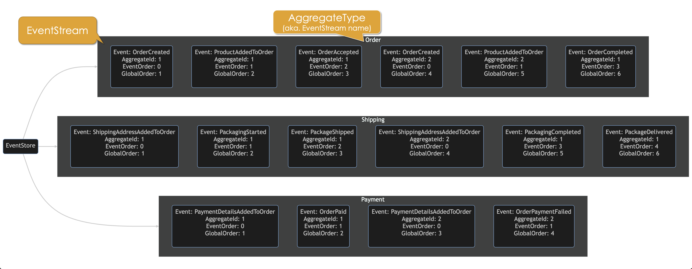
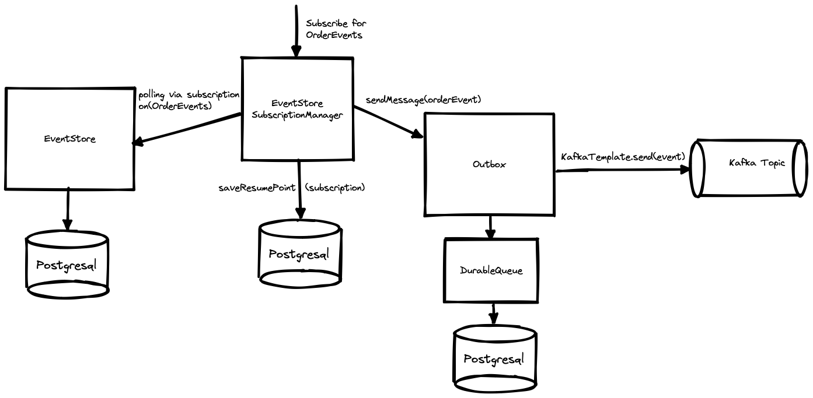
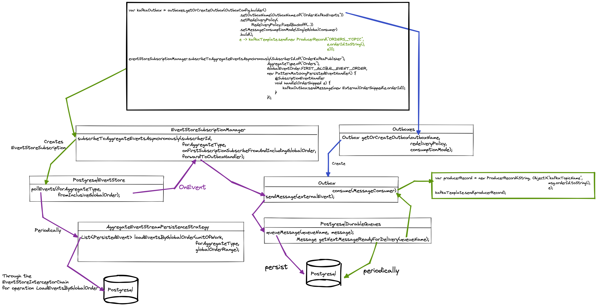

# Essentials Components - PostgreSQL Event Store

This library contains a fully features Event Store

## Concept

An EventStore is like a digital storage system for events related to different aspects of a business process.
These events represent various changes that happen over time.

Inside the EventStore, events are organized into separate groups called EventStreams.
Each EventStream has a **name** and represents a specific category or aspect of the business process.
In the Essentials we also refer to the `EventStreamName` as the `AggregateType`, because we (typically want to) store all Events related to a specific type of business object,
aka. an Aggregate Type, in the same EventStream.  This also allows us to subscribe to and track events per `AggregateType`. 

In this example, we have three EventStreams named "Order", "Shipping", and "Payment", each corresponding to different stages in an e-commerce process:




Classical examples of Aggregate Types and their associated events are:

- **Order** aggregate  
  *Examples of Order Events:*
    - OrderCreated
    - ProductAddedToOrder
    - ProductRemoveFromOrder
    - OrderAccepted
- **Account** aggregate  
  *Examples of Account Events:*
    - AccountRegistered
    - AccountCredited
    - AccountDebited
- **Customer** aggregate  
  *Examples of Customer Events:*
    - CustomerRegistered
    - CustomerMoved
    - CustomersAddressCorrected
    - CustomerStatusChanged

As mentioned, every event in an `EventStream` belongs to a broader category called an Aggregate.   
Each Aggregate is identified by a unique AggregateId. Said another way an `Aggregate` groups together related events (it groups Events that share the same `AggregateId`)

Each event contains information about the Aggregate it belongs to, as well as two values called `EventOrder` and `GlobalEventOrder`.   
The `EventOrder` indicates the sequence of the event within its `Aggregate`, starting from 0.  
When a new event is added to the same `Aggregate` instance, its `EventOrder` is set to the `EventOrder` of the latest event in the `Aggregate` `+1`.

On the other hand, the `GlobalEventOrder` is a number that shows the overall sequence of events in the entire `EventStream`, regardless of which `Aggregate` instance they belong to.  
The first `GlobalEventOrder` has a value of 1 and increases sequentially as new events are added.

### Persistence Strategy
We could put all Events from all Aggregate Types into one Event Stream, but this is often not very useful:

- From a usage and use case perspective it makes more sense to subscribe and handle events related to the same type of
  Aggregates separate from the handling of other Events related to other types of
  Aggregates.
    - E.g. it makes more sense to handle Order related Events separate from Account related Events
- Using the `SeparateTablePerAggregateTypePersistenceStrategy` we can store all Events related to a
  specific `AggregateType` in a separate table from other Aggregate types, which is more efficient and
  allows us to store many more Events related to this given `AggregateType`.  
  This allows use to use the PersistedEvent.globalEventOrder() to track the order in which Events, related to the same
  type of Aggregate, were persisted.    
  This also allows us to use the GlobalEventOrder as a natual Resume-Point for the EventStore subscriptions (see
  EventStoreSubscriptionManager)

This aligns with the concept of the `AggregateEventStream` which contains Events related to a specific `AggregateType` instance, i.e.
an Aggregate with a distinct **AggregateId**  
When loading/fetching and persisting/appending Events we always work at the Aggregate instance level, i.e.
with `AggregateEventStream`'s.

The `AggregateType` is used for grouping/categorizing multiple `AggregateEventStream` instances related to similar types
of aggregates.  
Unless you're using a fully functional style aggregate, where you only perform a Left-Fold of all Events in an
AggregateEventStream, then there will typically be a 1-1 relationship between
an `AggregateType` and the class that implements the Aggregate.

### `AggregateType` vs `Aggregate` implementation type
What's important here is that the `AggregateType` is only a name (i.e. the an `EventStreamName`) and shouldn't be confused with the Fully Qualified
Class Name of the `Aggregate`'s implementation class.   
This is the classical split between the logical concept and the physical implementation.  
It's important to not link the `Aggregate` Implementation Class (the Fully Qualified Class Name) with the `AggregateType`
name as that would make refactoring of your code base much harder, as the Fully
Qualified Class Name (`FQCN`) then would be captured in the stored Events.  
Had the `AggregateType` and the `Aggregate` Implementation Class been one and the same, then moving the `Aggregate` class to
another package or renaming it would break many things.   
To avoid the temptation to use the same name for both the `AggregateType` and the `Aggregate` Implementation Class, we
prefer using the **plural name** of the `Aggregate` as the `AggregateType` name.  
Example:

| Aggregate-Type | Aggregate Implementation Class (Fully Qualified Class Name) | Top-level Event Type (Fully Qualified Class Name) |  
|----------------|-------------------------------------------------------------|---------------------------------------------------|
| Orders         | com.mycompany.project.persistence.Order                     | com.mycompany.project.persistence.OrderEvent      |
| Accounts       | com.mycompany.project.persistence.Account                   | com.mycompany.project.persistence.AccountEvent    |
| Customer       | com.mycompany.project.persistence.Customer                  | com.mycompany.project.persistence.CustomerEvent   |

## Setup JDBI

The `PostgresqlEventStore` internally uses the Jdbi JDBC API.  
Below is an example of how to configure Jdbi - See `Spring-PostgreSQL Event Store` for a Spring oriented setup

```java
var jdbi = Jdbi.create(jdbcUrl,
                           username,
                           password);
jdbi.installPlugin(new PostgresPlugin());
jdbi.setSqlLogger(new SqlExecutionTimeLogger());
```

Example of setting up Jdbi using `HikariDataSource`:

```java
HikariConfig hikariConfig = new HikariConfig();
hikariConfig.setJdbcUrl(jdbcUrl);
hikariConfig.setUsername(username);
hikariConfig.setPassword(password);

var ds = new HikariDataSource(hikariConfig);
var jdbi = Jdbi.create(ds);
jdbi.installPlugin(new PostgresPlugin());
jdbi.setSqlLogger(new SqlExecutionTimeLogger());
```

## UnitOfWork / Transaction Management

Setup the EventStore using transaction/UnitOfWork management by the EventStore: `EventStoreManagedUnitOfWorkFactory`    
See `Spring-PostgreSQL Event Store` for a Spring oriented setup that uses Spring's Transaction handling and where you don't need
to work directly with the `UnitOfWork` concept.

```java
var persistenceStrategy = new SeparateTablePerAggregateTypePersistenceStrategy(jdbi,
                                                                               new EventStoreManagedUnitOfWorkFactory(jdbi),
                                                                               new MyPersistableEventMapper());
eventStore = new PostgresqlEventStore<>(unitOfWorkFactory,
                                        persistenceStrategy);
```

## PersistableEventMapper

The `MyPersistableEventMapper` is a mapper that you need to write in order to provide a translation between generic Java
based Events such as `OrderAdded`, `OrderAccepted` and the `PersistableEvent`
type that the `EventStore` knows how to persist.  
The custom `PersistableEventMapper` can also provide context specific information such as `Tenant`, `CorrelationId`,
etc.

Here an example of a `TestPersistableEventMapper`:

```java
class TestPersistableEventMapper implements PersistableEventMapper {
        private final CorrelationId correlationId   = CorrelationId.random();
        private final EventId       causedByEventId = EventId.random();

        @Override
        public PersistableEvent map(Object aggregateId, 
                                    AggregateTypeConfiguration aggregateEventStreamConfiguration, 
                                    Object event, 
                                    EventOrder eventOrder) {
            return PersistableEvent.from(EventId.random(),
                                         aggregateEventStreamConfiguration.aggregateType,
                                         aggregateId,
                                         EventTypeOrName.with(event.getClass()),
                                         event,
                                         eventOrder,
                                         EventRevision.of(1),
                                         new EventMetaData(),
                                         OffsetDateTime.now(),
                                         causedByEventId,
                                         correlationId,
                                         TenantId.of("MyTenant"));
        }
    }
```

## Define the `AggregateType`'s that can be persisted.

An `AggregateType` should not be confused with the Java implementation class for your Aggregate (see
the `EventSourced-Aggregates` module).

An `AggregateType` is used for grouping/categorizing multiple `AggregateEventStream` instances related to similar types
of aggregates.  
This allows us to easily retrieve or be notified of new Events related to the same type of Aggregates (such as when
using `EventStore#pollEvents(..)`)     
Using `SeparateTablePerAggregateTypePersistenceStrategy` means that each `AggregateType` will be persisted in a separate
event store table.

What's important here is that the AggregateType is only a name and shouldn't be confused with the Fully Qualified Class
Name (FQCN) of the `Aggregate` implementation class.  
This is the classical split between the logical concept and the physical implementation.  
It's important to not link the `Aggregate` Implementation Class (FQCN) with the `AggregateType`
name as that would make refactoring of your code base much harder, as the FQCN then would be captured in the stored Events.   
Had the `AggregateType` and the `Aggregate` Implementation Class been one and the same, then moving the Aggregate class to
another package or renaming it would break many things.

To avoid the temptation to use the same name for both the AggregateType and the Aggregate Implementation Class, we
prefer using the plural name of the Aggregate as the AggregateType name.  
Example:

| Aggregate-Type | Aggregate Implementation Class (Fully Qualified Class Name) | Top-level Event Type (Fully Qualified Class Name) |  
|----------------|-------------------------------------------------------------|---------------------------------------------------|
| Orders         | com.mycompany.project.persistence.Order                     | com.mycompany.project.persistence.OrderEvent      |
| Accounts       | com.mycompany.project.persistence.Account                   | com.mycompany.project.persistence.AccountEvent    |
| Customer       | com.mycompany.project.persistence.Customer                  | com.mycompany.project.persistence.CustomerEvent   |

You can add as many `AggregateType` configurations as needed, but they need to be added BEFORE you try to persist or
load events related to a given `AggregateType`.

Using defaults

```java
var orders = AggregateType.of("Order");
eventStore.addAggregateEventStreamConfiguration(orders,
                                                OrderId.class);
```

or

```java
var orders = AggregateType.of("Order");
eventStore.addAggregateEventStreamConfiguration(
    SeparateTablePerAggregateTypeConfiguration.standardSingleTenantConfiguration(orders,
                                                  new JacksonJSONEventSerializer(createObjectMapper()),
                                                  AggregateIdSerializer.serializerFor(OrderId.class),
                                                  IdentifierColumnType.UUID,
                                                  JSONColumnType.JSONB));
```

### ObjectMapper setup

All events stored in the `EventStore` are serialized to JSON.
The `EventStore` supports custom serialization through the  `JSONSerializer` concept.
The default `JSONSerializer` implementation is the `JacksonJSONSerializer` which must be initialized using an
`ObjectMapper` instance.

The setup of the `ObjectMapper` needs to support the type of Events being persisted.
To support storing the strong types, such as `EventId` used by the `PersistedEvent` type, the ObjectMapper needs to be
configured with the
[Essential Types Jackson]|(https://github.com/cloudcreate-dk/essentials/tree/main/types-jackson)
module's `EssentialTypesJacksonModule`.

Below is an example of an immutable Event design, which requires the `ObjectMapper` to be configured with
the [Essentials Immutable-Jackson](https://github.com/cloudcreate-dk/essentials/tree/main/immutable-jackson)
module's `EssentialsImmutableJacksonModule`:

```java
public class OrderEvent {
    public final OrderId orderId;

    public OrderEvent(OrderId orderId) {
        this.orderId = orderId;
    }

    public static class OrderAdded extends OrderEvent {
        public final CustomerId orderingCustomerId;
        public final long       orderNumber;

        public OrderAdded(OrderId orderId, CustomerId orderingCustomerId, long orderNumber) {
            super(orderId);
            this.orderingCustomerId = orderingCustomerId;
            this.orderNumber = orderNumber;
        }
    }

    public static class ProductAddedToOrder extends OrderEvent {
        public final ProductId productId;
        public final int       quantity;

        public ProductAddedToOrder(OrderId orderId, ProductId productId, int quantity) {
            super(orderId);
            this.productId = productId;
            this.quantity = quantity;
        }
    }
}
```

```java
private ObjectMapper createObjectMapper() {
    var objectMapper = JsonMapper.builder()
                                 .disable(MapperFeature.AUTO_DETECT_GETTERS)
                                 .disable(MapperFeature.AUTO_DETECT_IS_GETTERS)
                                 .disable(MapperFeature.AUTO_DETECT_SETTERS)
                                 .disable(MapperFeature.DEFAULT_VIEW_INCLUSION)
                                 .disable(SerializationFeature.WRITE_DATES_AS_TIMESTAMPS)
                                 .disable(DeserializationFeature.FAIL_ON_UNKNOWN_PROPERTIES)
                                 .disable(SerializationFeature.FAIL_ON_EMPTY_BEANS)
                                 .enable(MapperFeature.AUTO_DETECT_CREATORS)
                                 .enable(MapperFeature.AUTO_DETECT_FIELDS)
                                 .enable(MapperFeature.PROPAGATE_TRANSIENT_MARKER)
                                 .addModule(new Jdk8Module())
                                 .addModule(new JavaTimeModule())
                                 .addModule(new EssentialTypesJacksonModule())      // Needed to support serializing and deserializing Essential Types such as EventId, OrderId, etc.
                                 .addModule(new EssentialsImmutableJacksonModule()) // Needed if the Event is immutable (i.e. doesn't have a default constructor)
                                 .build();

    objectMapper.setVisibility(objectMapper.getSerializationConfig().getDefaultVisibilityChecker()
                                           .withGetterVisibility(JsonAutoDetect.Visibility.NONE)
                                           .withSetterVisibility(JsonAutoDetect.Visibility.NONE)
                                           .withFieldVisibility(JsonAutoDetect.Visibility.ANY)
                                           .withCreatorVisibility(JsonAutoDetect.Visibility.ANY));
    return objectMapper;
}
```

## Appending Events to an AggregateType's EventStream

Normally events are appended or fetched using the `AggregateRepository` pattern, but it's also possible to perform this
directly against the `EventStore`.

Example of appending the `OrderAdded` event, related to the `"Orders"` `AggregateType` with **aggregateId** specified by
the `orderId` variable:

```java
var orders = AggregateType.of("Order");

eventStore.unitOfWorkFactory().usingUnitOfWork(unitOfWork -> {
   var orderId = OrderId.random();
   eventStore.appendToStream(orders,
                             orderId,
                             new OrderAdded(orderId,
                                            CustomerId.random(),
                                            1234));
});
```

## Fetching Events from an AggregateType's EventStream

Example fetching an `AggregateEventStream` for the `"Orders"` `AggregateType` with **aggregateId** specified by
the `orderId` variable:

```java
var orders = AggregateType.of("Order");

var events = eventStore.unitOfWorkFactory().withUnitOfWork(unitOfWork -> {
  return eventStore.fetchStream(orders, orderId);
});
```

## EventBus event subscription

You can subscribe (synchronous or asynchronous) to events directly on the `EventStore` by e.g. adding a subscriber to
the `EventBus`

```java
eventStore.localEventBus().addSyncSubscriber(persistedEvents -> {
            
});
eventStore.localEventBus().addAsyncSubscriber(persistedEvents -> {
    
});
```

## EventStore asynchronous Event polling

You can also poll for events using the `EventStore` event polling mechanism, which allows you to subscribe to any point
in an EventStream related to a given type of Aggregate:

```java
var orders = AggregateType.of("Order");
// poll using default polling interval, tenant filtering, etc.
disposableFlux = eventStore.pollEvents(orders, // Aggregatetype
                                       GlobalEventOrder.FIRST_GLOBAL_EVENT_ORDER, // What is the first GlobalOrder to return
                                      ).subscribe(event -> {
        	                               // Handle events
                                      });
```

## EventStreamGapHandler

The `PostgresqlEventStore` can be configured with an `EventStreamGapHandler`, which keeps track of
transient and permanent AggregateType event-stream gaps, related to a specific `SubscriberId`.

Two `EventStreamGapHandler` are supported:

- `NoEventStreamGapHandler` (default if you just create a new `PostgresqlEventStore` instance)
- `PostgresqlEventStreamGapHandler`
  - Example:
  ```java
    @Bean
    public ConfigurableEventStore<SeparateTablePerAggregateEventStreamConfiguration> eventStore(EventStoreUnitOfWorkFactory<? extends EventStoreUnitOfWork> eventStoreUnitOfWorkFactory,
                                                                                                SeparateTablePerAggregateTypePersistenceStrategy persistenceStrategy,
                                                                                                EventStoreEventBus eventStoreLocalEventBus) {
        return new PostgresqlEventStore<>(eventStoreUnitOfWorkFactory,
                                          persistenceStrategy,
                                          Optional.of(eventStoreLocalEventBus),
                                          eventStore -> new PostgresqlEventStreamGapHandler<>(eventStore, eventStoreUnitOfWorkFactory));

    }
  ```

The `EventStore.pollEvents(...)` operation will keep track of event stream gaps if you specify a `SubscriberId`.  
A transient event stream gap is defined as a gap in an event stream, where a `PersistedEvent.globalEventOrder()`
is missing in the list of `PersistedEvents` returned from `EventStore.loadEventsByGlobalOrder(...)`  
A gap will remain transient until the `EventStreamGapHandler` determines that the gap has met the permanent gap
criteria (e.g. if the gap has existed for more than the current database transaction timeout) after which the gap is promoted to permanent gap status  
After this the gap will be marked as permanent and won't be included in future calls to `EventStore.loadEventsByGlobalOrder(...)`  
Permanent gaps are maintained across all Subscriber's at the `AggregateType` level and can be reset using `resetPermanentGapsFor(AggregateType)`/`resetPermanentGapsFor(AggregateType, LongRange)` and
`resetPermanentGapsFor(AggregateType, List)` methods

## EventStore SubscriptionManager

Finally, you can use the `EventStoreSubscriptionManager`, which supports:

### Subscribe asynchronously

Using asynchronous event subscription the `EventStoreSubscriptionManager` will keep track of where the individual
Subscribers `ResumePoint` in the AggregateType EventStream's they subscribing to:

- `exclusivelySubscribeToAggregateEventsAsynchronously` - uses the `FencedLockManager` to ensure that only a single
  subscriber, with the same combination of `SubscriberId` and `AggregateType`, in the
  cluster can subscribe.
- `subscribeToAggregateEventsAsynchronously` - same as above, just without using the `FencedLockManager` to coordinate
  subscribers in a cluster

Example using `exclusivelySubscribeToAggregateEventsAsynchronously`:

```java
var eventStoreSubscriptionManager = EventStoreSubscriptionManager.builder()
                                                                 .setEventStore(eventStore)
                                                                 .setEventStorePollingBatchSize(10)
                                                                 .setEventStorePollingInterval(Duration.ofMillis(100))
                                                                 .setFencedLockManager(fencedLockManager)
                                                                 .setSnapshotResumePointsEvery(Duration.ofSeconds(10))
                                                                 .setDurableSubscriptionRepository(new PostgresqlDurableSubscriptionRepository(jdbi))
                                                                 .build();

eventStoreSubscriptionManager.start();

var orders = AggregateType.of("Order");
var productsSubscription = eventStoreSubscriptionManager.exclusivelySubscribeToAggregateEventsAsynchronously(
        SubscriberId.of("OrdersSub1"),
        orders,
        GlobalEventOrder.FIRST_GLOBAL_EVENT_ORDER, // The initial subscription points. Only applies the first time you subscribe
                                                   // All subsequent subscriptions for the same subscriber, the EventStoreSubscriptionManager
                                                   // keeps track of the Resume Point using the PostgresqlDurableSubscriptionRepository
        Optional.empty(),
        new FencedLockAwareSubscriber() {
            @Override
            public void onLockAcquired(FencedLock fencedLock, SubscriptionResumePoint resumeFromAndIncluding) {
            }

            @Override
            public void onLockReleased(FencedLock fencedLock) {
            }
        },
        new PersistedEventHandler() {
            @Override
            public void onResetFrom(EventStoreSubscription eventStoreSubscription, GlobalEventOrder globalEventOrder) {
              // You can reset the Resume Point using the resetFrom(..) method after which this method will be called
              // and the Resume Point in the EventStoreSubscriptionManager will be reset to the same value
              // and the event stream will start streaming events from the new Resume Point       
            }

            @Override
            public void handle(PersistedEvent event) {
                
            }
        });
```

When using

- `EventStoreSubscriptionManager#exclusivelySubscribeToAggregateEventsAsynchronously(SubscriberId, AggregateType, GlobalEventOrder, Optional, PersistedEventHandler)`
- `EventStoreSubscriptionManager#subscribeToAggregateEventsAsynchronously(SubscriberId, AggregateType, GlobalEventOrder, Optional, PersistedEventHandler)`

then you can also use Event Pattern matching, using the `PatternMatchingPersistedEventHandler` to automatically call
methods annotated with the `@SubscriptionEventHandler`
annotation and where the 1st argument matches the actual Event type (contained in the `PersistedEvent#event()`) provided
to the `PersistedEventHandler#handle(PersistedEvent)` method:

- If the `PersistedEvent#event()` contains a **typed/class based Event** then it matches on the 1st argument/parameter
  of the `@SubscriptionEventHandler` annotated method.
- If the `PersistedEvent#event()` contains a **named Event**, then it matches on a `@SubscriptionEventHandle` annotated
  method that accepts a `String` as 1st argument.

Each method may also include a 2nd argument that of type `PersistedEvent` in which case the event that's being matched
is included as the 2nd argument in the call to the method.        
The methods can have any accessibility (private, public, etc.), they just have to be instance methods.

```java
public class MyEventHandler extends PatternMatchingPersistedEventHandler {

        @Override
        public void onResetFrom(EventStoreSubscription eventStoreSubscription, GlobalEventOrder globalEventOrder) {

        }

        @SubscriptionEventHandler
        public void handle(OrderEvent.OrderAdded orderAdded) {
            ...
        }

        @SubscriptionEventHandler
        private void handle(OrderEvent.ProductAddedToOrder productAddedToOrder) {
          ...
        }
       
        @SubscriptionEventHandler
        private void handle(OrderEvent.ProductRemovedFromOrder productRemovedFromOrder, PersistedEvent productRemovedFromOrderPersistedEvent) {
          ...
        }

        @SubscriptionEventHandler
        private void handle(String json, PersistedEvent jsonPersistedEvent) {
          ...
        }

}
```
### EventProcessor

The easiest way to asynchronously subscribe to Events from one or more AggregatesTypes/EventStreams is to use the EventProcessor.  
An `EventProcessor` can subscribe to multiple `EventStore` Event Streams (e.g. a stream of Order events or a stream of Product events).  
To ensure efficient processing and prevent conflicts, only a single instance of a concrete `EventProcessor` in a cluster can have an active Event Stream subscription at a time (using Fenced Locking).   

To enhance throughput, you can control the number of parallel threads utilized for handling messages.  
Consequently, events associated with different aggregate instances within an EventStream can be concurrently processed.  

The `EventProcessor` also ensures ordered handling of events, partitioned by aggregate id. I.e. events related to a specific aggregate id will always be processed in the exact order they were originally added to the `EventStore`.  
This guarantees the preservation of the chronological sequence of events for each individual aggregate, maintaining data integrity and consistency, even during event redelivery/poison-message handling.  

Event Modeling style Event Sourced Event Processor and Command Handler, which is capable of both containing `@CmdHandler` as well as `@MessageHandler` annotated event handling methods.    
Instead of manually subscribing to the underlying `EventStore` using the `EventStoreSubscriptionManager`, which requires you to provide your own error and retry handling, you can use the `EventProcessor` 
to subscribe to one or more `EventStore` event streams, while providing you with error and retry handling using the common `RedeliveryPolicy` concept.  
You must override `reactsToEventsRelatedToAggregateTypes()` to specify which EventSourced `AggregateType` event-streams the `EventProcessor` should subscribe to.  
The `EventProcessor` will set up an exclusive asynchronous `EventStoreSubscription` for each AggregateType and will forward any `PersistedEvent`'s as `OrderedMessage`'s IF and ONLY IF the concrete `EventProcessor` 
subclass contains a corresponding `@MessageHandler` annotated method matching the `PersistedEvent.event()`'s `EventJSON.getEventType()`'s `EventType.toJavaClass()` matches that first argument type.

#### Example subscribing for AggregateEvent and publishing an External Event to Kafka using the `EventProcessor`
```java
@Service
@Slf4j
public class ShippingEventKafkaPublisher extends EventProcessor {
    public static final String                        SHIPPING_EVENTS_TOPIC_NAME = "shipping-events";
    private final       KafkaTemplate<String, Object> kafkaTemplate;


    public ShippingEventKafkaPublisher(@NonNull Inboxes inboxes,
                                       @NonNull DurableLocalCommandBus commandBus,
                                       @NonNull EventStoreSubscriptionManager eventStoreSubscriptionManager,
                                       @NonNull KafkaTemplate<String, Object> kafkaTemplate) {
        super(eventStoreSubscriptionManager,
              inboxes,
              commandBus);
        this.kafkaTemplate = kafkaTemplate;
    }

    @Override
    public String getProcessorName() {
        return "ShippingEventsKafkaPublisher";
    }

    @Override
    protected List<AggregateType> reactsToEventsRelatedToAggregateTypes() {
        return List.of(ShippingOrders.AGGREGATE_TYPE);
    }

    @MessageHandler
    void handle(OrderShipped e) {
        log.info("*** Received {} for Order '{}' and adding it to the Outbox as a {} message", e.getClass().getSimpleName(), e.orderId, ExternalOrderShipped.class.getSimpleName());
        var externalEvent = new ExternalOrderShipped(e.orderId);
        log.info("*** Forwarding {} message to Kafka. Order '{}'", externalEvent.getClass().getSimpleName(), externalEvent.orderId);
        var producerRecord = new ProducerRecord<String, Object>(SHIPPING_EVENTS_TOPIC_NAME,
                                                                externalEvent.orderId.toString(),
                                                                externalEvent);
        kafkaTemplate.send(producerRecord);
        log.info("*** Completed sending event {} to Kafka. Order '{}'", externalEvent.getClass().getSimpleName(), externalEvent.orderId);
    }
}
```

#### Example Subscribing for Aggregate events and publishing an External Event to Kafka via an Outbox



```java
var kafkaOutbox = outboxes.getOrCreateOutbox(OutboxConfig.builder()
                                                         .setOutboxName(OutboxName.of("ShippingOrder:KafkaShippingEvents"))
                                                         .setRedeliveryPolicy(RedeliveryPolicy.fixedBackoff(Duration.ofMillis(100), 10))
                                                         .setMessageConsumptionMode(MessageConsumptionMode.SingleGlobalConsumer)
                                                         .setNumberOfParallelMessageConsumers(1)
                                                         .build(),
                                             e -> {
                                                 var producerRecord = new ProducerRecord<String, Object>(SHIPPING_EVENTS_TOPIC_NAME,
                                                                                                         e.orderId.toString(),
                                                                                                         e);
                                                 kafkaTemplate.send(producerRecord);
                                             });

// Subscribe ShippingOrder events and add only OrderShipped event to the Outbox as an ExternalOrderShipped event
eventStoreSubscriptionManager.subscribeToAggregateEventsAsynchronously(SubscriberId.of("ShippingEventKafkaPublisher-ShippingEvents"),
                                                                       ShippingOrders.AGGREGATE_TYPE,
                                                                       GlobalEventOrder.FIRST_GLOBAL_EVENT_ORDER,
                                                                       Optional.empty(),
                                                                       new PatternMatchingPersistedEventHandler() {
                                                                           @Override
                                                                           protected void handleUnmatchedEvent(PersistedEvent event) {
                                                                               // Ignore any events not explicitly handled - the original logic throws an exception to notify subscribers of unhandled events
                                                                           }

                                                                           @SubscriptionEventHandler
                                                                           void handle(OrderShipped e) {
                                                                               unitOfWorkFactory.usingUnitOfWork(() -> kafkaOutbox.sendMessage(new ExternalOrderShipped(e.orderId)));
                                                                           }
                                                                       });
```
The internal flow is shown below:


### Subscribe synchronously

Synchronous subscription allows you to receive and react to Events published within the active Transaction/`UnitOfWork`
that's involved in `appending` the events to the `EventStream`
This can be useful for certain transactional views/projections where you require transactional consistency (e.g.
assigning a sequential customer number, etc.):

- `subscribeToAggregateEventsInTransaction`

```java
var eventStoreSubscriptionManager = EventStoreSubscriptionManager.createFor(eventStore,
                                                                             50,
                                                                             Duration.ofMillis(100),
                                                                             PostgresqlFencedLockManager.builder()
                                                                                                        .setJdbi(jdbi)
                                                                                                        .setUnitOfWorkFactory(unitOfWorkFactory)
                                                                                                        .setLockTimeOut(Duration.ofSeconds(3))
                                                                                                        .setLockConfirmationInterval(Duration.ofSeconds(1))
                                                                                                        .buildAndStart(),
                                                                             Duration.ofSeconds(1),
                                                                             new PostgresqlDurableSubscriptionRepository(jdbi));
eventStoreSubscriptionManager.start();

var productsSubscription = eventStoreSubscriptionManager.subscribeToAggregateEventsInTransaction(
        SubscriberId.of("ProductSubscriber"),
        AggregateType.of("Products"),
        Optional.empty(),
        new TransactionalPersistedEventHandler() {
            @Override
            public void handle(PersistedEvent event, UnitOfWork unitOfWork) {
               ...
            }
        });
```

When using

- `EventStoreSubscriptionManager#subscribeToAggregateEventsInTransaction(SubscriberId, AggregateType, Optional, TransactionalPersistedEventHandler)`

then you can also use Event Pattern matching, using the pattern matching `TransactionalPersistedEventHandler`.  
The `PatternMatchingTransactionalPersistedEventHandler` will automatically call methods annotated with
the `@SubscriptionEventHandler` annotation and where the 1st argument matches the actual Event
type (contained in the `PersistedEvent#event()` provided to the `PersistedEventHandler#handle(PersistedEvent)` method
and where the 2nd argument is a `UnitOfWork`:

- If the `PersistedEvent#event()` contains a **typed/class based Event** then it matches on the 1st argument/parameter
  of the `@SubscriptionEventHandler` annotated method.
- If the `PersistedEvent#event()` contains a **named Event**, then it matches on a `@SubscriptionEventHandle` annotated
  method that accepts a `String` as 1st argument.

Each method may also include a 3rd argument that of type `PersistedEvent` in which case the event that's being matched
is included as the 3rd argument in the call to the method.  
The methods can have any accessibility (private, public, etc.), they just have to be instance methods.

Example:

```java
public class MyEventHandler extends PatternMatchingTransactionalPersistedEventHandler {

        @SubscriptionEventHandler
        public void handle(OrderEvent.OrderAdded orderAdded, UnitOfWork unitOfWork) {
            ...
        }

        @SubscriptionEventHandler
        private void handle(OrderEvent.ProductAddedToOrder productAddedToOrder, UnitOfWork unitOfWork) {
          ...
        }

        @SubscriptionEventHandler
        private void handle(OrderEvent.ProductRemovedFromOrder productRemovedFromOrder, UnitOfWork unitOfWork, PersistedEvent productRemovedFromOrderPersistedEvent) {
          ...
        }

        @SubscriptionEventHandler
        private void handle(String json, UnitOfWork unitOfWork, PersistedEvent jsonPersistedEvent) {
          ...
        }
}
```

To use `Postgresql Event Store` just add the following Maven dependency:

```xml
<dependency>
    <groupId>dk.cloudcreate.essentials.components</groupId>
    <artifactId>postgresql-event-store</artifactId>
    <version>0.20.12</version>
</dependency>
```